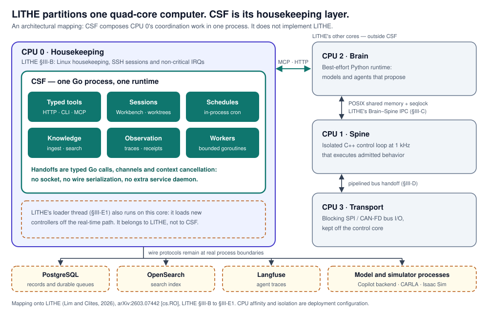
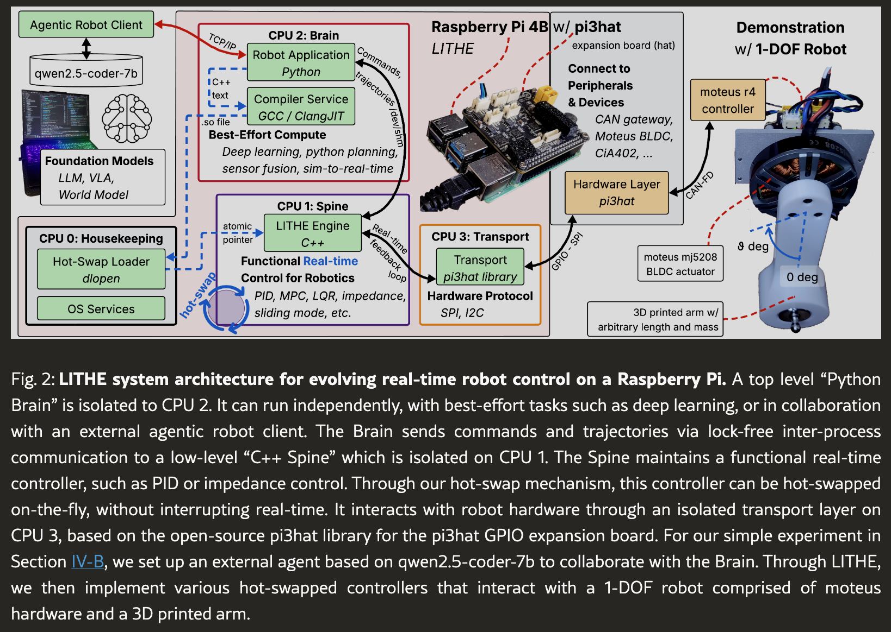
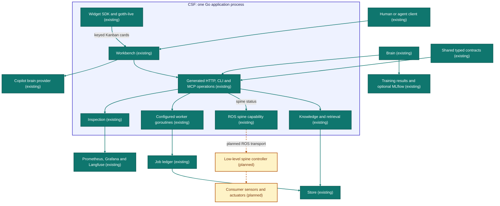

<div align="center">
  
  <p><b>One Go runtime for agent work, typed tools, shared knowledge and observable experiments.</b></p>
  <p>
    <a href="LICENSE"></a>
    <a href="#6-consume-it"></a>
    <a href="#8-build-it"></a>
    <a href="https://arxiv.org/abs/2603.07442"></a>
    <a href="#1-introduction"></a>
  </p>
  <p>
    <a href="docs/TOUR.md"><b>Take the tour</b></a> ·
    <a href="#what-is-csf"><b>What is CSF</b></a> ·
    <a href="#north-star"><b>North star</b></a> ·
    <a href="#2-why-csf-no-ipc-inside-cpu-0"><b>Why CSF</b></a> ·
    <a href="#3-proofs-not-just-hardware-csf-and-lithes-safety-problem"><b>Proofs</b></a> ·
    <a href="#4-architecture"><b>Architecture</b></a> ·
    <a href="#5-quick-start"><b>Quick start</b></a> ·
    <a href="csf/README.md"><b>CSF guide</b></a> ·
    <a href="AGENTS.md"><b>Agent instructions</b></a> ·
    <a href="#10-citation"><b>Citation</b></a>
  </p>
</div>

<hr>

## What is CSF

<!-- agent-drafted (#379): awaiting operator approval -->

Most robots run two kinds of software side by side: a slow, best-effort layer
that decides what to do (planning, perception, learned policies) and a fast,
real-time layer that does it (the control loop that must never miss a deadline).
LITHE ([Lim and Clites, 2026](#ref-lithe)) turns that split into an architecture on
one ordinary computer. A best-effort **[Brain](csf/docs/generated/ontology_cgen.md#term-brain)** proposes, a real-time
**[Spine](csf/docs/generated/ontology_cgen.md#term-spine)** executes, and each gets its own CPU [core](csf/docs/generated/ontology_cgen.md#term-core). On LITHE's
quad-core board, CPU 1 runs the Spine's control loop alone, CPU 2 runs the Brain,
CPU 3 handles the motor bus, and **CPU 0** is the [housekeeping](docs/GLOSSARY.md#lit-housekeeping)
core: it takes the operating system's chores, absorbs timing jitter so the other
cores never feel it, and prepares the next controller before it is swapped in.
LITHE demonstrates this on one robot, but deciding versus doing is the shape of
most robot software stacks, so we expect the architecture to carry over to most
robots.

**CSF is the LITHE philosophy applied to CPU 0.** It is the housekeeping layer:
the tools, records, schedules and experiments around an [agent](csf/docs/generated/ontology_cgen.md#term-agent) system's
decisions, composed into one Go process so they talk through function calls
instead of inter-process communication. In CSF the architecture is a checked
artifact and the engineers are [agents](csf/docs/generated/ontology_cgen.md#term-agent) working under rules. It ships
with working implementations ([gotth-live](csf/docs/generated/ontology_cgen.md#term-gotth_live), Warden, xetcas, pgmem,
liquidproto) that prove the loop works.

<p align="center">
  
</p>

**New here? [Take the tour of CSF](docs/TOUR.md):** ten stops from the idea to the running pieces, each with a diagram, real code, an example next to a counterexample, and one command to run.

It has four parts, and together they form one loop:

1. **A language.** [`architecture.csf`](csf/compiler/language/architecture.csf)
   declares what the system is: its terms (124 today), how they contain and
   depend on each other, and the paper each borrowed word comes from. For
   example: `term widget "Widget" "A component of gotth-live ..."`.
2. **A [compiler](csf/docs/generated/ontology_cgen.md#term-compiler), `csfc`.** It checks the code against that declaration and
   generates what used to be hand-written: the [glossary](docs/GLOSSARY.md),
   the [dictionary](csf/docs/generated/ontology_cgen.md), the architecture
   diagrams below, and this README's north star. For example,
   [`tools/merge-pr.sh`](tools/merge-pr.sh) refuses a pull request whose
   ontology alignment score regresses against `main`.
3. **A [harness](csf/docs/generated/ontology_cgen.md#term-harness).** One process per machine runs coding-agent
   [sessions](csf/docs/generated/ontology_cgen.md#term-session) with a [gate](csf/docs/generated/ontology_cgen.md#term-session_gate) on every shell
   command and every commit. For example,
   `harness submit -recipe agent.json` starts an [agent](csf/docs/generated/ontology_cgen.md#term-agent) that cannot run a
   polling loop and whose first commit opens a draft pull request.
4. **Miners ([ouroboros](csf/docs/generated/ontology_cgen.md#term-ouroboros)).** They read the operator–[agent](csf/docs/generated/ontology_cgen.md#term-agent) record and the repository, find
   where intent and code diverge, and turn each divergence into the next gate
   or change. For example, on 2026-10-02 the finding that 64 of the 124 terms
   own no directory became a ticket that states the gate's predicate; the gate
   itself is not built yet.

### What it can be used as

An agent-operated deployment system: propose and approve changes, reconcile [applications](csf/docs/generated/ontology_cgen.md#term-application), approve infrastructure updates, and watch the fleet. An [agent](csf/docs/generated/ontology_cgen.md#term-agent) harness with gates on every command and commit. A server-driven live UI that syncs state with a browser. A self-hosted build and evidence cache. Fast tests with real SQL and no server.

What you get, grouped by what it is for:

- **[CSF — The Cerebrospinal Fluid](csf)**, the core: a Go library and [runtime](csf/docs/generated/ontology_cgen.md#term-runtime) for the coordination around an [agent](csf/docs/generated/ontology_cgen.md#term-agent) system, covering typed tools, sessions and worktrees, schedules, [knowledge](csf/docs/generated/ontology_cgen.md#term-knowledge) ingestion and search, traces and retained evidence. Its [services](csf/docs/generated/ontology_cgen.md#term-service) are libraries [mounted](csf/docs/generated/ontology_cgen.md#term-mount) into one Go process through functional options, and each operation is generated once and served as HTTP, CLI and [MCP](csf/docs/generated/ontology_cgen.md#term-mcp). Start with the [consumer example](examples/csf-consumer).
  - **[Agent harness and ops view](app/harness):** one process per machine runs every [agent](csf/docs/generated/ontology_cgen.md#term-agent) session with gates on every command and commit. The `csf` binary is both that process and its client: `csf init` puts CSF into a repository, `csf submit` takes an [assignment](csf/docs/generated/ontology_cgen.md#term-assignment) recipe, `csf send` adds a turn, and `csf view` serves a [gotth-live](csf/docs/generated/ontology_cgen.md#term-gotth_live) page with one live card per session ([command reference](app/harness/cmd)). See [Quick start](#5-quick-start).
  - **[`csfc` compiler](csf/compiler/README.md):** checks the code against [`architecture.csf`](csf/compiler/language/architecture.csf) and generates the [glossary](docs/GLOSSARY.md), the [dictionary](csf/docs/generated/ontology_cgen.md), the diagrams and this README's north star.
- **[Deploy](services/deploy)**, an agent-operated deployment system: an [agent](csf/docs/generated/ontology_cgen.md#term-agent) harness proposes, the deploy [service](csf/docs/generated/ontology_cgen.md#term-service) approves and fences every change, the node executor reconciles Compose [applications](csf/docs/generated/ontology_cgen.md#term-application), and the operator UI watches.
  - **[Deploy service and node executor](services/deploy)**, with the [deployment kit](infra/deploy-kit/) for Compose [applications](csf/docs/generated/ontology_cgen.md#term-application).
  - **[Warden](services/warden):** the fleet watchdog the deploy service fences against: Raft-style leader election [[5]](#ref-raft) over a static peer set, liveness, incidents, and an authoritative view every mutation is checked against.
- **Libraries** you can use on their own:
  - **[gotth-live](pkg/gotth):** server-driven live user interfaces from Go. [Widgets](csf/docs/generated/ontology_cgen.md#term-widget), event handlers and state are synced from the [application](csf/docs/generated/ontology_cgen.md#term-application) layer, and the browser renders each change as the [app](csf/docs/generated/ontology_cgen.md#term-app) commits it. State and rendering stay in your process; one WebSocket per tab carries events up and re-rendered fragments down. No npm, no CDN.
  - **[xetcas](xetcas):** a self-hosted Xet [[6]](#ref-xet) content-addressable storage server with a Git LFS [[7]](#ref-git-lfs) front door, used for build caches, snapshots and evidence archival. Re-pushing a 48 MiB model after editing 2% of it costs about 1 MiB.
  - **[`pkg/`](pkg):** domain-neutral Go primitives: [`pgmem`](pkg/pgmem), a process-local PostgreSQL [[8]](#ref-postgres) emulator for fast tests (real PostgreSQL AST, no server); [`liquidproto`](pkg/liquidproto), the [runtime](csf/docs/generated/ontology_cgen.md#term-runtime) for Liquid Proto, protobuf with [refinement types](docs/GLOSSARY.md#lit-refinement_types) [[9]](#ref-refinement-types) compiled into the generated Go; [`cron`](pkg/cron), [`config`](pkg/config), [`redact`](pkg/redact), [`telemetry`](pkg/telemetry), [`mailbox`](pkg/mailbox), and more.

The north star is a robot software
stack whose correctness is proven end to end; today that is a goal, not a
capability: the generated table below reports no completed milestone, and the
`csfc` verifier does not yet issue certificates. It ships as one Go monorepo
with a CLI.

## 1. Introduction

The name comes from the architecture that shaped it. In LITHE
([Lim and Clites, 2026](#ref-lithe)), a best-effort **[Brain](csf/docs/generated/ontology_cgen.md#term-brain)** proposes and a real-time **[Spine](csf/docs/generated/ontology_cgen.md#term-spine)** executes, on one
partitioned computer. CSF is the fluid around them: the [housekeeping](docs/GLOSSARY.md#lit-housekeeping) layer that
carries tools, records and experiments between decisions.



*LITHE, Figure 2 ([Lim and Clites, 2026](#ref-lithe)).*

New to the words used here? The [glossary](docs/GLOSSARY.md) explains every CSF
term in plain language, plus the words CSF borrows from papers, with citations.

First-party source is Apache-2.0. Dependencies, vendor simulator images and
paper figures retain their own licenses.

<!-- csf:north_star correctness -->
## North star

*Generated from [architecture.csf](csf/compiler/language/architecture.csf); change that file, not this section.*

**Goal.** End-to-end correctness of a robot software stack, proven relative to stated assumptions and checked against them at [runtime](csf/docs/generated/ontology_cgen.md#term-runtime). The physical world and the models in it are not proven; the envelope around them is: check before execute, contracts at every io boundary, and [runtime](csf/docs/generated/ontology_cgen.md#term-runtime) monitors with a safe fallback.

**Milestones.** 0 done, 6 in progress, 1 planned. A done milestone names a path in this repository that the generator checks exists; PR and issue numbers refer to the source monorepo.

| # | Milestone | Status | Terms | Evidence | Builds on |
|---|---|---|---|---|---|
| 1 | Every io boundary is a typed capability: a [service](csf/docs/generated/ontology_cgen.md#term-service) crosses only what its constructor was granted, and the io tree is sorted by crossing tier. Process launch and PostgreSQL are capabilities today; the move into the tier-sorted io directories is planned. | in progress | [I/O crossing](csf/docs/generated/ontology_cgen.md#term-io), [Crossing tier](csf/docs/generated/ontology_cgen.md#term-tier), [Capability](csf/docs/generated/ontology_cgen.md#term-capability) | [`ipc/proc`](ipc/proc), [`ipc/db/csfpg`](ipc/db/csfpg), PR #290, PR #301, PR #321, issue #264 | — |
| 2 | Each crossing's tier is resolved from [runtime](csf/docs/generated/ontology_cgen.md#term-runtime) and placement state instead of being declared by hand. | planned | [Crossing tier](csf/docs/generated/ontology_cgen.md#term-tier), [Placement rules](csf/docs/generated/ontology_cgen.md#term-placement), [Runtime](csf/docs/generated/ontology_cgen.md#term-runtime) | issue #264 | — |
| 3 | The low-level controller is reached only through the ros seam, whose contract is proven ROS-side and monitored CSF-side with a safe fallback. The stub that answers every call with a typed not-connected error ships; the transport, proof and monitor are planned. | in progress | [ROS spine capability](csf/docs/generated/ontology_cgen.md#term-ros), [Low-level spine controller](csf/docs/generated/ontology_cgen.md#term-spine), [Check](csf/docs/generated/ontology_cgen.md#term-check) | [`ipc/ros`](ipc/ros), PR #299 | [KeYmaera X](https://keymaerax.org/) ([glossary](docs/GLOSSARY.md#lit-keymaera_x)), [VeriPhy](https://doi.org/10.1145/3192366.3192406) ([glossary](docs/GLOSSARY.md#lit-veriphy)) |
| 4 | Turn executors are interchangeable behind one contract while CSF owns the session, its context and its tools. Claude Code runs as the first [turn executor](csf/docs/generated/ontology_cgen.md#term-turn_executor); CSF does not yet own the session's context. | in progress | [Turn executor](csf/docs/generated/ontology_cgen.md#term-turn_executor), [Workbench conversation session](csf/docs/generated/ontology_cgen.md#term-session), [Claude Code provider](csf/docs/generated/ontology_cgen.md#term-claudecode) | [`ipc/model/claudecode`](ipc/model/claudecode), [`examples/claudecode`](examples/claudecode), PR #322 | — |
| 5 | Every unit of the system climbs the compilability ladder from prose to structured, typed, checked and finally discharged, where a checker discharges a stated proof obligation. csfc checks the declared architecture against its Go source on every change, and its check-generated command states lifetime and cleanup obligations that it does not yet discharge. | in progress | [Compiler](csf/docs/generated/ontology_cgen.md#term-compiler), [Compile](csf/docs/generated/ontology_cgen.md#term-compile), [Shared typed contracts](csf/docs/generated/ontology_cgen.md#term-contracts) | [`csf/compiler/architecture`](csf/compiler/architecture), issue #329 | [CompCert](https://compcert.org/) ([glossary](docs/GLOSSARY.md#lit-compcert)), [seL4](https://sel4.systems/) ([glossary](docs/GLOSSARY.md#lit-sel4)) |
| 6 | The system improves itself through [Ouroboros](csf/docs/generated/ontology_cgen.md#term-ouroboros), under gates it may not change: mined evidence proposes each change and every accepted change is an operator-approved pull request. Session mining exists in the source monorepo, outside this repository; the CSF [service](csf/docs/generated/ontology_cgen.md#term-service) is planned. | in progress | [Ouroboros](csf/docs/generated/ontology_cgen.md#term-ouroboros), [Evaluate](csf/docs/generated/ontology_cgen.md#term-evaluate), [Save evidence](csf/docs/generated/ontology_cgen.md#term-save_evidence) | PR #237 | — |
| 7 | No hand-written documentation: every claim is typed data in architecture.csf and its prose is generated, this section included. | in progress | [Compiler](csf/docs/generated/ontology_cgen.md#term-compiler), [Compile](csf/docs/generated/ontology_cgen.md#term-compile) | [`csf/compiler/language/architecture.csf`](csf/compiler/language/architecture.csf), [`docs/GLOSSARY.md`](docs/GLOSSARY.md), PR #333 | — |

<!-- /csf:north_star correctness -->

## 2. Why CSF: no IPC inside CPU 0

LITHE runs a whole robot control hierarchy on one quad-core single-board
computer by partitioning its [cores](csf/docs/generated/ontology_cgen.md#term-core) (LITHE
[§III-B](https://arxiv.org/html/2603.07442v1#S3.SS2)):

| LITHE [core](csf/docs/generated/ontology_cgen.md#term-core) | Role in LITHE |
|---|---|
| **CPU 0 ([Housekeeping](docs/GLOSSARY.md#lit-housekeeping))** | Linux [housekeeping](docs/GLOSSARY.md#lit-housekeeping), SSH sessions and non-critical interrupts. It absorbs system jitter, and LITHE's loader thread prepares new controllers here (LITHE [§III-E1](https://arxiv.org/html/2603.07442v1#S3.SS5.SSS1)). |
| CPU 1 ([Spine](csf/docs/generated/ontology_cgen.md#term-spine)) | The C++ control loop, alone on an isolated [core](csf/docs/generated/ontology_cgen.md#term-core). |
| CPU 2 ([Brain](csf/docs/generated/ontology_cgen.md#term-brain)) | The high-level Python [runtime](csf/docs/generated/ontology_cgen.md#term-runtime). |
| CPU 3 (Transport) | Blocking SPI/CAN bus I/O, kept off the control [core](csf/docs/generated/ontology_cgen.md#term-core). |

LITHE treats inter-process communication as architecture (LITHE
[§III-C](https://arxiv.org/html/2603.07442v1#S3.SS3)): the [Brain](csf/docs/generated/ontology_cgen.md#term-brain) and [Spine](csf/docs/generated/ontology_cgen.md#term-spine) exchange state through lock-free, zero-copy
POSIX shared memory whose layout a build-time generator owns. Its abstract names
complex middleware as one cost of the conventional alternatives.

The coordination an [agent](csf/docs/generated/ontology_cgen.md#term-agent) system needs — tools, sessions, schedules, [knowledge](csf/docs/generated/ontology_cgen.md#term-knowledge)
and observation — lands on the [housekeeping](docs/GLOSSARY.md#lit-housekeeping) side of that partition. Built the
usual way, each capability is its own daemon, and every handoff inside CPU 0
becomes a socket, a serialization format and another process lifecycle to
supervise.

**CSF prevents that [IPC](csf/docs/generated/ontology_cgen.md#term-ipc) problem inside CPU 0 by composing those capabilities in
one Go process.** [Services](csf/docs/generated/ontology_cgen.md#term-service) are Go libraries selected with functional options.
They exchange typed values through function calls and coordinate concurrent work
with [goroutines](csf/docs/generated/ontology_cgen.md#term-goroutine) and channels; contexts and explicit ownership give each
operation a cancellation and cleanup path. An internal handoff needs no socket,
no wire serialization and no separate daemon. Separate architecture
checks inspect selected Go ownership and [process boundaries](csf/docs/generated/ontology_cgen.md#term-process_boundary) in source; they
establish those source constraints, not [runtime](csf/docs/generated/ontology_cgen.md#term-runtime) timing.

The diagram at the top of this page is our architectural mapping onto LITHE [[1](#ref-lithe)], drawn
by hand; it is not generated from the architecture model. Its boundaries are exact:

- PostgreSQL, [OpenSearch](csf/docs/generated/ontology_cgen.md#term-opensearch), Langfuse and external model or simulator processes
  keep their protocol boundaries. CSF removes [IPC](csf/docs/generated/ontology_cgen.md#term-ipc) between its own capabilities,
  not [IPC](csf/docs/generated/ontology_cgen.md#term-ipc) with systems that genuinely live elsewhere.
- LITHE's [Brain](csf/docs/generated/ontology_cgen.md#term-brain)–[Spine](csf/docs/generated/ontology_cgen.md#term-spine) shared-memory [IPC](csf/docs/generated/ontology_cgen.md#term-ipc) remains a separate integration boundary.
- CPU affinity and isolation are deployment configuration. CSF does not
  implement LITHE's loader, CPU isolation or real-time controller [hot swap](docs/GLOSSARY.md#lit-hot_swap).

[`examples/csf-consumer`](examples/csf-consumer/main.go) shows the composition:
CSF, its generated routes, its [MCP](csf/docs/generated/ontology_cgen.md#term-mcp) server and the consumer's own endpoint in one
router owned by the consumer's process.

## 3. Proofs, not just hardware: CSF and LITHE's safety problem

LITHE is explicit about where its guarantee stops. Its user-space real-time
approach "provides a functional margin of safety, even if it lacks the formal
mathematical guarantees of a verified real-time operating system"
(LITHE [§V-A](https://arxiv.org/html/2603.07442v1#S5.SS1)). For model-written
controllers, "it remains an area of active research to implement appropriate
safety and verification bounds on the model's output"
(LITHE [§V-B](https://arxiv.org/html/2603.07442v1#S5.SS2)); "theoretical stability
guarantees remain an open challenge", so safety "must be enforced via strict
hardware-level limits on torque and velocity"
(LITHE [§V-C](https://arxiv.org/html/2603.07442v1#S5.SS3)).

A hardware limit is enforced per device. A proof about a language holds for
every program written in it. CSF's direction is to narrow what a model may
author to a typed, bounded language, and to prove what that language's compiled
code computes. The model then chooses among checked options instead of emitting
arbitrary code. That is how we think LITHE's idea scales past one robot on one
bench.

**What is proved today.** [`csf/examples/proof/BrainSpine.lean`](csf/examples/proof/BrainSpine.lean)
models the arithmetic slice of
[`brainspine.proto`](proto/candace/brainspine/v1/brainspine.proto): a typed
expression language with constants, four observation slots, addition, integer
scaling and clamping over saturating integers, compiled to a postfix stack
machine. Lean machine-checks four theorems:

| Theorem | Guarantee |
|---|---|
| `compile_correct` | For every expression, inputs and existing stack, the compiled instructions push exactly the evaluated value and preserve the stack. |
| `evaluate_bounds` | Every expression evaluates within the saturation bound `[-1000000000, 1000000000]`. |
| `compiled_actuator_correct` | Compiled code run from an empty stack, then through the actuator clamp, agrees exactly with the clamped source evaluator. |
| `compiled_actuator_bounds` | Every compiled expression produces an actuator value in `[-1000, 1000]`. |

`bash csf/examples/proof/check.sh` downloads the pinned Lean release, verifies
its SHA-256, runs Lean with `--trust=0`, and audits the axioms of all four
theorems: only Lean's standard `propext`, `Classical.choice` and `Quot.sound`
are admitted, and `sorryAx` or custom axioms fail the check. CI runs it in its
own job.

**What is not proved.** Be precise about the gap:

- Agreement between the Lean model and the canonical wire semantics is a
  reviewed translation boundary. CSF ships no controller implementation: the
  low-level [spine](csf/docs/generated/ontology_cgen.md#term-spine) is external and ROS-side, reached through `ipc/ros`.
- The `csfc` compiler verifier is a
  [stub](csf/compiler/verification/README.md): `CSFC.Verification.verify`
  returns `notImplemented` for every input and issues no certificate.
- The actuator clamp proves a numeric range only. Timing, stability, collision
  avoidance, safe controller switching and physical safety are outside every
  theorem here. A hardware watchdog remains necessary.
- The Lean kernel, its official release build, the standard library, the
  operating system and the hardware remain trusted.

The improvement loop below is generated from the same architecture model as
every CSF diagram. *[Choose](csf/docs/generated/ontology_cgen.md#term-choose)* and controller selection are planned: the
low-level controller is external and ROS-side, and an [agent](csf/docs/generated/ontology_cgen.md#term-agent) choosing among
proved options is the next step, not a shipped one.

```mermaid
%% Generated from csf/compiler/language/architecture.csf; do not edit.
%% Documentation model only; status labels do not establish runtime verification.
flowchart LR
  classDef csf_existing fill:#0F766E,stroke:#115E59,stroke-width:2px,color:#FFFFFF;
  classDef csf_planned fill:#FEF3C7,stroke:#B45309,stroke-width:2px,color:#78350F;
  n_observe["Observe (existing)"]:::csf_existing
  n_retrieve["Retrieve (existing)"]:::csf_existing
  n_choose["Choose (planned)"]:::csf_planned
  n_check["Check (existing)"]:::csf_existing
  n_execute["Execute (existing)"]:::csf_existing
  n_evaluate["Evaluate (existing)"]:::csf_existing
  n_save_evidence["Save evidence (existing)"]:::csf_existing
  n_ouroboros["Ouroboros (planned)"]:::csf_planned
  n_select_controller["Select a controller between episodes (planned)"]:::csf_planned
  n_observe -.-> n_retrieve
  n_retrieve -.-> n_choose
  n_choose -.-> n_check
  n_check --> n_execute
  n_execute --> n_evaluate
  n_evaluate --> n_save_evidence
  n_evaluate -.-> n_select_controller
  n_select_controller -.->|"next agent iteration"| n_choose
  n_save_evidence -.-> n_ouroboros
  n_ouroboros -.->|"next iteration"| n_observe
  linkStyle 0 stroke:#B45309,stroke-width:2px,stroke-dasharray:5 5
  linkStyle 1 stroke:#B45309,stroke-width:2px,stroke-dasharray:5 5
  linkStyle 2 stroke:#B45309,stroke-width:2px,stroke-dasharray:5 5
  linkStyle 3 stroke:#0F766E,stroke-width:2px
  linkStyle 4 stroke:#0F766E,stroke-width:2px
  linkStyle 5 stroke:#0F766E,stroke-width:2px
  linkStyle 6 stroke:#B45309,stroke-width:2px,stroke-dasharray:5 5
  linkStyle 7 stroke:#B45309,stroke-width:2px,stroke-dasharray:5 5
  linkStyle 8 stroke:#B45309,stroke-width:2px,stroke-dasharray:5 5
  linkStyle 9 stroke:#B45309,stroke-width:2px,stroke-dasharray:5 5
```

<!-- csf:diagram improvement -->

<!-- /csf:diagram improvement -->

## 4. Architecture

The diagram is **generated** from
[`csf/compiler/language/architecture.csf`](csf/compiler/language/architecture.csf)
by the CSF documentation compiler, which also produces the
[shared vocabulary](csf/docs/generated/ontology_cgen.md) and the plain-language
[glossary](docs/GLOSSARY.md). Solid connections are
existing components or configurable integrations; dotted connections are
planned. An integration shown here still needs its dependencies and
configuration; it is not automatically running when you import CSF.

<!-- csf:diagram architecture -->

<!-- /csf:diagram architecture -->

### Stores and data structures

CSF separates *what* data is from *where* it lives, following the ANSI/SPARC
three-level architecture [[2]](#ref-ansi-sparc) and Codd's physical data
independence [[3]](#ref-codd):

| CSF | ANSI/SPARC | Meaning |
|---|---|---|
| data structure (`pkg/graph`, Cell, Map, Queue) | conceptual level | the data and its operations, with no placement, locks or I/O |
| store (`pkg/store.Store[D]`) | internal level | the physical placement of a data structure: memory (RAM), a file, or PostgreSQL; its crossing tier is derived from that backend |
| `store places data_structure` | conceptual/internal mapping | changing a store's backend never changes code written against the data structure (physical data independence) |
| view, dashboard | external level (specializes) | generated projections of typed records, not per-user schemas |

*Status: operator ruling recorded 2026-10-02; `pkg/graph`, `pkg/store` and the ontology
terms are planned (source monorepo issue #366). The in-process Queue exists today in
[`io/inproc`](io/inproc).*

### Aspects: hooks on service actions

Anything that does something is a [service](csf/docs/generated/ontology_cgen.md#term-service),
and cross-cutting behavior attaches to a [service](csf/docs/generated/ontology_cgen.md#term-service)'s actions the way aspect-oriented
programming attaches advice to join points [[4]](#ref-aop):

| CSF | AOP | Meaning |
|---|---|---|
| action | join point | a [service](csf/docs/generated/ontology_cgen.md#term-service) operation (an RPC method); the only thing a hook attaches to |
| hook | advice (before/after) | pre or post code on one action, supplied as a generated functional option such as `WithPreSubmit`, typed by that action's request and response |
| pointcut | pointcut | a typed selector of actions |
| aspect | aspect | one cross-cutting concern: a pointcut plus its hooks, e.g. the [session gate](csf/docs/generated/ontology_cgen.md#term-session_gate), telemetry, admission, the merge gate |
| weaving (specializes) | weaving | applying aspects when the host [app](csf/docs/generated/ontology_cgen.md#term-app) composes its [services](csf/docs/generated/ontology_cgen.md#term-service); no source or bytecode rewriting |

An action CSF does not execute itself, such as `git commit`, enters through an
adapter [service](csf/docs/generated/ontology_cgen.md#term-service) whose operation is the join point.

*Status: operator ruling recorded 2026-10-02; the generated options and ontology
terms are planned (source monorepo issue #374).*

### What is in here

```text
.
├── csf/          typed coordination library, contracts, examples and consumer guide
├── pkg/          domain-neutral primitives — nothing in them knows about any service
├── services/     composable business logic — deploy, warden, the agent harness, cron, ops view and more
├── app/          runnable compositions — csf, harness, deploy, node executor, warden, intake
├── runtime/      the process runtime: the lifetimes every goroutine starts under
├── ipc/          boundary crossings, each a capability granted through a constructor
├── io/           the in-process io tier (io/inproc)
├── web/          the deploy service's and node executor's web layers
├── proto/        .proto sources and their committed Go bindings
├── infra/        deploy-kit/ (Compose stack, installer, fleet driver, updater) and local dev services
├── tools/        build wrapper, house gates, the CSF kit installer and the csf operator CLI
├── xetcas/       a Rust workspace (xetcasd) plus its generated Go bindings
├── examples/     one worked consumer per extension seam, each with its own suite
├── extensions/   copilot-pair, a GitHub Copilot CLI extension
├── docs/         extending.md (the four compile-time seams) and GLOSSARY.md (for humans)
└── bazel/        the legacy WORKSPACE shim
```

The three Go trees are separated by one rule, about who may import whom:

| Imports | Allowed direction |
|---|---|
| Runnable compositions (`app/`) | [Services](csf/docs/generated/ontology_cgen.md#term-service), CSF and shared packages |
| Domain [services](csf/docs/generated/ontology_cgen.md#term-service) and CSF | Shared packages |
| Domain-neutral packages (`pkg/`) | No import of [services](csf/docs/generated/ontology_cgen.md#term-service) or [application](csf/docs/generated/ontology_cgen.md#term-application) compositions |

Nothing in `pkg/` imports `services/` or `app/`, which is what makes the
primitives usable on their own:

| Package | What it is |
|---|---|
| [`gotth`](pkg/gotth) | Server-driven live UI. Large enough to have its own documentation set. [And it does](pkg/gotth/docs/README.md). |
| [`pgmem`](pkg/pgmem) | A process-local PostgreSQL emulator for fast tests — real PostgreSQL AST, no server. |
| [`cron`](pkg/cron) | The schedule grammar: human-readable trigger declarations and their canonical five-field form. The scheduler that fires them is [`services/cron`](services/cron). |
| [`liquidproto`](pkg/liquidproto) | The [runtime](csf/docs/generated/ontology_cgen.md#term-runtime) for Liquid Proto: protobuf with refinement predicates compiled into the generated Go. |
| [`telemetry`](pkg/telemetry) | Trace propagation and structured JSONL over the `candace.telemetry.v1` contracts, with no observability SDK. |
| [`config`](pkg/config) | Configuration-boundary parsing: environment lookup, private-origin validation, `provider/model` strings. |
| [`mailbox`](pkg/mailbox) | Serializes ownership of a mutable value onto one [goroutine](csf/docs/generated/ontology_cgen.md#term-goroutine) — commands run in turn, so no field needs a lock. |
| [`boundedbuffer`](pkg/boundedbuffer) | An `io.Writer` that retains at most a fixed number of bytes while still reporting the true write lengths. |
| [`redact`](pkg/redact) | Removes caller-declared sensitive values, and their URL-userinfo spellings, from log-bound text. |
| [`labels`](pkg/labels) | Canonicalizes case-insensitive label lists so [services](csf/docs/generated/ontology_cgen.md#term-service) compare and deduplicate them one way. |
| [`core`](pkg/core) | The zerolog logger the Go trees log through, plus the few formatters operator pages share. |
| [`eventually`](pkg/eventually) | The one typed await for tests: poll a value, judge it with a predicate, get the value that satisfied it back. |
| [`widget`](pkg/widget) | The [widget](csf/docs/generated/ontology_cgen.md#term-widget) dialect and its toolchain: interpreter, validator, generator, and the typed SDK that [mounts](csf/docs/generated/ontology_cgen.md#term-mount) generated cards into a [gotth-live](csf/docs/generated/ontology_cgen.md#term-gotth_live) host. |

`pkg/proto` and `pkg/scripts` hold tooling rather than a package.

## 5. Quick start

**To put CSF into a repository of yours, run `csf init` at its root.** It
writes a sample [assignment](csf/docs/generated/ontology_cgen.md#term-assignment) under `.csf/` and registers the repository with
this machine's [agent](csf/docs/generated/ontology_cgen.md#term-agent) harness, starting it if none is running. Then:

```bash
csf submit -recipe .csf/assignments/sample/agent.json   # an agent session starts
csf events -assignment <id>                              # ends with a draft pull request
csf chat -assignment <id>                                # the session's chat address
```

`csf` comes from this repository, once per machine, with only Docker on the
machine: `tools/kit/install.sh` from a clone. [The CSF kit guide](tools/kit/README.md)
walks every step, its success check and how to undo it.

Use Go 1.26. The smallest CSF example needs no database, GPU, model account or
extra process:

```bash
go run ./examples/csf-theme --listen 127.0.0.1:8089 --theme-dir ./examples/csf-theme
```

That [mounts](csf/docs/generated/ontology_cgen.md#term-mount) the generated HTTP API and [MCP](csf/docs/generated/ontology_cgen.md#term-mcp) at `http://127.0.0.1:8089/mcp`. The
caller owns the process; CSF only registers routes and hands back a handler.
From [`examples/csf-consumer/main.go`](examples/csf-consumer/main.go):

```go
service, err := csf.New(options...)
if err != nil {
	return nil, fmt.Errorf("create CSF: %w", err)
}
router := httpserver.NewEngine(applicationName)
service.Register(router)
router.Any(mcpPath, gin.WrapH(service.MCPHandler()))
registerConsumerSummary(router, service)
```

**Agent-native onboarding.** The intended first instruction to your [agent](csf/docs/generated/ontology_cgen.md#term-agent) is
*“Learn about CSF.”* The `LearnAboutCSF` [MCP](csf/docs/generated/ontology_cgen.md#term-mcp) operation explains the pinned
version's capabilities and extension points and, when [knowledge](csf/docs/generated/ontology_cgen.md#term-knowledge) is configured,
submits the embedded guidance plus selected consumer files for indexing. Your
own tools join the same [MCP](csf/docs/generated/ontology_cgen.md#term-mcp) server with typed inputs and outputs; the pinned [MCP](csf/docs/generated/ontology_cgen.md#term-mcp)
SDK derives and validates their schemas, and CSF rejects name collisions with
its own operations. The signature, from [`csf/service.go`](csf/service.go):

```go
func WithMCPTool[In, Out any](tool mcp.Tool, handler mcp.ToolHandlerFor[In, Out]) Option
```

The host still owns listener startup, authentication, repository authorization
and consumer checks. The [CSF guide](csf/README.md) covers the [Workbench](csf/docs/generated/ontology_cgen.md#term-bench),
onboarding and every example with its boundary.

**[gotth-live](csf/docs/generated/ontology_cgen.md#term-gotth_live)**, the [web layer](csf/docs/generated/ontology_cgen.md#term-web) CSF's [Workbench](csf/docs/generated/ontology_cgen.md#term-bench) uses, runs with no npm or code
generation:

```bash
go run ./examples/gotth/counter
```

```text
counter: http://127.0.0.1:8080
counter: allowed origins [http://127.0.0.1:8080 http://localhost:8080]
```

Open that URL in two browser tabs. The number lives in the Go process and
neither tab holds a copy of it: click in one and the other repaints, reload
either and the count survives, and the client script that carried the patch
was compiled into the binary and served by the same handler that serves the
WebSocket. [`examples/gotth/counter/README.md`](examples/gotth/counter/README.md)
follows one click all the way through and names the file each step lives in.
The optional CSF [Workbench](csf/docs/generated/ontology_cgen.md#term-bench) has a separate browser-asset build documented in its
README.

## 6. Consume it

### This repository is generated

It is a **one-way snapshot** of the canonical repository at one exact revision,
published with no upstream history. <!-- agent-drafted (#379): awaiting operator approval -->The canonical repository is
private CSF staging since 2026-10-02; `v0.1.3` and earlier were exported from a
private monorepo's `candace/` folder. Snapshot updates arrive as ready pull
requests from the `candace-export` branch against `main`, and releases from
`candace-release`. Make source changes in the canonical repository; editing the generated
destination directly would conflict with its next snapshot.

After its review PR is merged, the publisher verifies that tree and creates
immutable `v<version>` and `export-<sha12>` tags. The GitHub Release uses the
semantic-version tag; `.candace-export.json` records the exact source revision.
Cite a tag, not a branch.

### Consume it in 60 seconds

Releases are published on `candacelabs/csf`; the current one is `v0.2.4`. For a
private staging release, download the release assets with authenticated access
and use the
[verified local-archive consumer](examples/csf-consumer#copy-into-your-own-go-repository).
The Go module path is `github.com/candacelabs/csf` in both cases.

New releases carry `csf-<sha12>.tar.gz` and its `.sha256`; historical releases
retain their original archive names. The tarball is
this tree re-rooted so `MODULE.bazel` is at the archive root, plus a deterministic
`.candace-source.json` recording the source revision and selected tree, built twice and
byte-compared before it is kept.

Download both files from the same Release. In their directory, replace `<sha12>`
with the 12-character revision from its tag and verify the hexadecimal checksum, then compute
the base64 SRI value required by Bazel (Bash, `sha256sum` and OpenSSL):

```bash
set -euo pipefail
archive='csf-<sha12>.tar.gz'
sha256sum --check "$archive.sha256"
printf 'sha256-'
openssl dgst -sha256 -binary "$archive" | openssl base64 -A
printf '\n'
```

Copy the complete `sha256-...` output line into `integrity` in your own
`MODULE.bazel`; the `.sha256` file's hexadecimal value is not an SRI value. The
archive's `module()` still declares version `0.1.0`, so `bazel_dep` keeps that
version while the URL names the release tag:

```python
bazel_dep(name = "csf", version = "0.1.0")

archive_override(
    module_name = "csf",
    integrity = "sha256-...",          # base64 SRI output from the command above
    strip_prefix = "csf-<sha12>",
    urls = ["https://github.com/candacelabs/csf/releases/download/v0.2.4/csf-<sha12>.tar.gz"],
)
```

Then depend on what you use — `@csf//services/deploy/component`,
`@csf//pkg/gotth/live`, `@csf//services/warden` — and build. Since `v0.2.0` the
deploy [service](csf/docs/generated/ontology_cgen.md#term-service) sits at `services/deploy/` and its kit at `infra/deploy-kit/`;
`v0.1.3` and earlier used `services/candaceos/` and `candaceos/`.

Not a Bazel repository? The module path is the repository path:

```bash
go get github.com/candacelabs/csf@v0.2.4
```

Use the published semantic version matching your archive, not `@latest`.
The accompanying `export-<sha12>` tag identifies its exact source snapshot.

[`docs/extending.md`](docs/extending.md) covers both shapes in full, plus the
`http_archive` fallback and the legacy `WORKSPACE` path.

## 7. Examples

Every extension seam has a worked example with its own test suite. They are the
contract's executable half — the documentation says what is guaranteed, and
these fail if it stops being true.

| Example | Shows |
|---|---|
| [`csf-consumer`](examples/csf-consumer) | CSF [mounted](csf/docs/generated/ontology_cgen.md#term-mount) beside a consumer's own Go endpoint in one process, its generated client, [MCP](csf/docs/generated/ontology_cgen.md#term-mcp) tool discovery and shutdown. Its archive acceptance script builds a fresh repository with networking disabled. |
| [`external-consumer`](examples/external-consumer) | A complete outside repository choosing every seam at once: its own identity and overlay, its own sidebar entry and page, three composed [services](csf/docs/generated/ontology_cgen.md#term-service), a custom [agent](csf/docs/generated/ontology_cgen.md#term-agent) harness, and the deploy [service](csf/docs/generated/ontology_cgen.md#term-service) binary linked from them — built and tested both supported Bazel ways. This is also the acceptance test every release archive passes. |
| [`custom-brand`](examples/custom-brand) | The deploy [service](csf/docs/generated/ontology_cgen.md#term-service) wearing another product's identity — name, [agent](csf/docs/generated/ontology_cgen.md#term-agent), wordmark, palette, an overlay asset, an extra sidebar entry and page — with no edit to the deploy [service](csf/docs/generated/ontology_cgen.md#term-service). |
| [`custom-ui-page`](examples/custom-ui-page) | The smallest useful UI extension: stock identity, one sidebar entry, one page of your own. |
| [`gotth/counter`](examples/gotth/counter) | [gotth-live](csf/docs/generated/ontology_cgen.md#term-gotth_live) at its smallest: a number that lives in Go, four buttons, and every open tab kept in step by the server. |
| [`gotth/chat`](examples/gotth/chat) | One room in Go, several browsers, and every message reaching every session over a server push. |
| [`gotth/dashboard`](examples/gotth/dashboard) | A feed pushing twenty times a second, three live regions patched independently, and two plain-HTMX regions on the same page. |

## 8. Build it

Bazel is the primary build and comes from a pinned container, so the command is
the same on a laptop and on a runner. Docker is the only prerequisite:

```bash
tools/bazel.sh build -- //... -//xetcas/...   # everything but the Rust workspace
tools/bazel.sh test  -- //... -//xetcas/...
tools/bazel.sh build //xetcas/...             # the Rust workspace and its Go bindings
tools/bazel.sh test  //xetcas/...
```

The plain `go` command works on the same tree and needs no Bazel:

```bash
go build ./...
go test ./...
```

The Rust workspace builds with plain Cargo too — that is the path its demo,
container images, and `just` targets take:

```bash
cd xetcas && cargo build --workspace && cargo test --workspace
```

`.bazelversion` (Bazel 9.2.0) and `MODULE.bazel` (rules_go 0.62.0, Gazelle
0.52.2, Go SDK 1.26.5, rules_rust 0.73.0) are the only version authority. BUILD
files are generated by Gazelle (`tools/bazel.sh run //:gazelle`) and CI fails on
drift.

### Run the deploy stack

The deployment kit installs and runs the whole one-box stack (deploy [service](csf/docs/generated/ontology_cgen.md#term-service),
node executor and operator UI) from this clone.
The default install is deliberately harmless: a simulated harness, a dry-run
executor, and no Docker socket bind-mounted anywhere.

```bash
./infra/deploy-kit/install.sh          # then open http://<host>:7780
./infra/deploy-kit/status.sh
./infra/deploy-kit/uninstall.sh
```

The deploy [service](csf/docs/generated/ontology_cgen.md#term-service) publishes on all host IPv4 interfaces with **no built-in authentication**:
put it behind your own authenticating proxy before exposing it beyond a trusted
network. [`infra/deploy-kit/README.md`](infra/deploy-kit/README.md) is the operations manual,
and [`infra/deploy-kit/AGENTS.md`](infra/deploy-kit/AGENTS.md) states the trust model as eight
invariants with their enforcement points.

## 9. Where to go next

- [`csf/README.md`](csf/README.md) — the CSF guide: [Workbench](csf/docs/generated/ontology_cgen.md#term-bench), onboarding,
  examples and release evidence.
- [`AGENTS.md`](AGENTS.md) — the repository's own guide: taxonomy, seams,
  invariants, conventions.
- [`docs/extending.md`](docs/extending.md) — the four compile-time seams and how
  to pin a snapshot.
- [`docs/GLOSSARY.md`](docs/GLOSSARY.md) — every CSF term and borrowed literature
  term in plain language, for human readers.
- [`pkg/gotth/README.md`](pkg/gotth/README.md), [`xetcas/README.md`](xetcas/README.md)
  — each subsystem's own front page.
- `app/*/CLAUDE.md` — what may not be changed casually in each binary.

## 10. Citation

<a id="ref-lithe"></a>

**[1]** He Kai Lim and Tyler R. Clites. *LITHE: Bridging Best-Effort Python and Real-Time
C++ for Hot-Swapping Robotic Control Laws on Commodity Linux.* arXiv:2603.07442
[cs.RO], 2026. Submitted to IROS 2026.
<https://doi.org/10.48550/arXiv.2603.07442>

```bibtex
@misc{lim2026lithe,
  title         = {{LITHE}: Bridging Best-Effort {Python} and Real-Time {C++} for Hot-Swapping Robotic Control Laws on Commodity {Linux}},
  author        = {Lim, He Kai and Clites, Tyler R.},
  year          = {2026},
  eprint        = {2603.07442},
  archivePrefix = {arXiv},
  primaryClass  = {cs.RO},
  doi           = {10.48550/arXiv.2603.07442},
  url           = {https://arxiv.org/abs/2603.07442},
  note          = {Submitted to IROS 2026}
}
```

CSF's architecture is inspired by LITHE [1]. To cite CSF itself, name the
exact release tag you used:

```bibtex
@software{csf2026,
  title   = {CSF — The Cerebrospinal Fluid},
  author  = {{Candace Labs}},
  version = {0.2.4},
  year    = {2026},
  url     = {https://github.com/candacelabs/csf}
}
```

The LITHE paper and its figures are distributed under arXiv's
[non-exclusive distribution license](http://arxiv.org/licenses/nonexclusive-distrib/1.0/),
not a Creative Commons license. © the authors; this repository's license does
not cover them, and no figure file is copied into it.

<a id="ref-ansi-sparc"></a>

**[2]** D. Tsichritzis and A. Klug. *The ANSI/X3/SPARC DBMS framework report of the
study group on database management systems.* Information Systems 3(3):173–191, 1978.
<https://doi.org/10.1016/0306-4379(78)90001-7>

<a id="ref-codd"></a>

**[3]** E. F. Codd. *A relational model of data for large shared data banks.*
Communications of the ACM 13(6):377–387, 1970. <https://doi.org/10.1145/362384.362685>

<a id="ref-aop"></a>

**[4]** G. Kiczales, J. Lamping, A. Mendhekar, C. Maeda, C. Lopes, J.-M. Loingtier and
J. Irwin. *Aspect-oriented programming.* ECOOP '97, LNCS 1241, pp. 220–242, 1997.
<https://doi.org/10.1007/BFb0053381>

<a id="ref-raft"></a>

**[5]** D. Ongaro and J. Ousterhout. *In search of an understandable consensus algorithm.*
2014 USENIX Annual Technical Conference (USENIX ATC 14), pp. 305–319, 2014.
<https://www.usenix.org/conference/atc14/technical-sessions/presentation/ongaro>

<a id="ref-xet"></a>

**[6]** Hugging Face. *xet-core: the Xet storage protocol, client and content-addressed
chunk format.* <https://github.com/huggingface/xet-core>

<a id="ref-git-lfs"></a>

**[7]** Git LFS contributors. *Git Large File Storage.* <https://git-lfs.com/>

<a id="ref-postgres"></a>

**[8]** M. Stonebraker and L. A. Rowe. *The design of POSTGRES.* Proceedings of the 1986
ACM SIGMOD International Conference on Management of Data, pp. 340–355, 1986.
<https://doi.org/10.1145/16894.16888>

<a id="ref-refinement-types"></a>

**[9]** T. Freeman and F. Pfenning. *Refinement types for ML.* Proceedings of the ACM
SIGPLAN 1991 Conference on Programming Language Design and Implementation (PLDI),
pp. 268–277, 1991. <https://doi.org/10.1145/113445.113468>

<a id="ref-keymaera-x"></a>

**[10]** N. Fulton, S. Mitsch, J.-D. Quesel, M. Völp and A. Platzer. *KeYmaera X: an
axiomatic tactical theorem prover for hybrid systems.* CADE-25, LNCS 9195,
pp. 527–538, 2015. <https://doi.org/10.1007/978-3-319-21401-6_36>

<a id="ref-veriphy"></a>

**[11]** R. Bohrer, Y. K. Tan, S. Mitsch, M. O. Myreen and A. Platzer. *VeriPhy: verified
controller executables from verified cyber-physical system models.* PLDI 2018,
pp. 617–630, 2018. <https://doi.org/10.1145/3192366.3192406>

<a id="ref-compcert"></a>

**[12]** X. Leroy. *Formal verification of a realistic compiler.* Communications of the
ACM 52(7):107–115, 2009. <https://doi.org/10.1145/1538788.1538814>

<a id="ref-sel4"></a>

**[13]** G. Klein, K. Elphinstone, G. Heiser, J. Andronick, D. Cock, P. Derrin,
D. Elkaduwe, K. Engelhardt, R. Kolanski, M. Norrish, T. Sewell, H. Tuch and
S. Winwood. *seL4: formal verification of an OS kernel.* SOSP 2009, pp. 207–220,
2009. <https://doi.org/10.1145/1629575.1629596>

The north star's "Builds on" column links KeYmaera X [10], VeriPhy [11], CompCert [12]
and seL4 [13].

## License

Apache License 2.0. See [`LICENSE`](LICENSE).

AI systems assisted with work in this repository. Their output is not presumed
correct, secure, reviewed, or production-ready.
