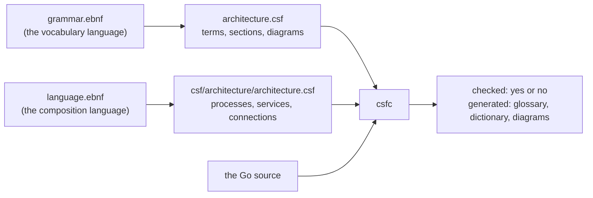
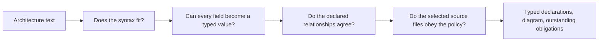
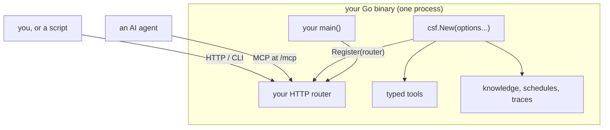
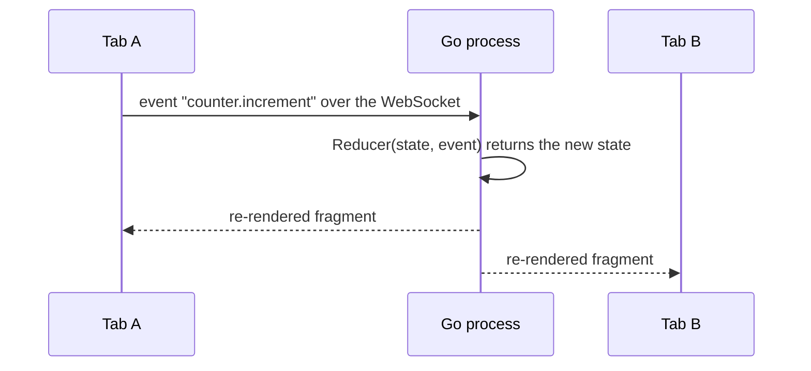
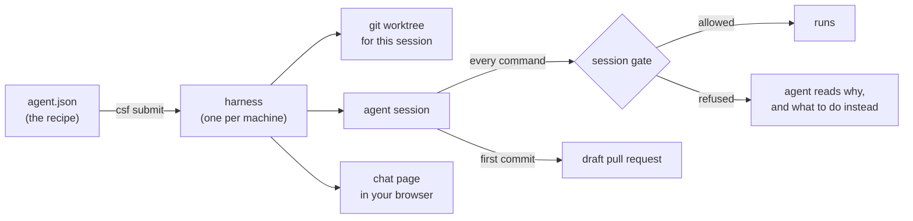
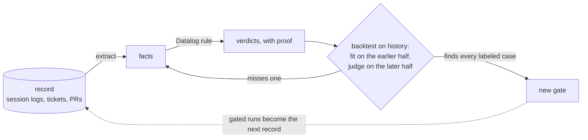
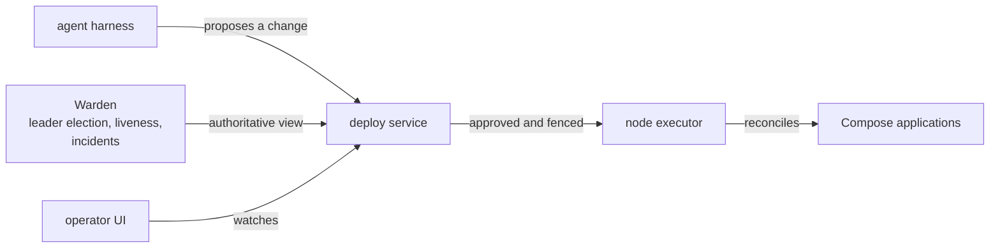
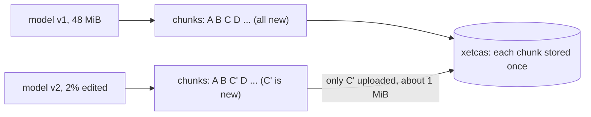

# A tour of CSF

This tour is for someone who has never seen CSF, LITHE or agent harnesses before.
It walks the repository in ten stops, in the order the pieces depend on each other.
Every stop has the same shape:

- **In one sentence:** what the piece is.
- **Why it exists:** the problem it solves, in plain words.
- **Picture:** a diagram of how it works.
- **What it looks like:** real code or text from this repository, with an example
  that is right and a counterexample that is wrong.
- **Try it:** one command, and what you should see.
- **Go deeper:** where to read next.

Every command runs from the repository root. The Bazel and kit stops need Docker;
the `go run` stops need Go 1.26. Nothing on the tour needs a model account, a GPU
or a database.

| stop | piece | time |
|---|---|---|
| 0 | [Words you will meet](#0-words-you-will-meet) | 2 min |
| 1 | [LITHE and CPU 0](#1-lithe-and-cpu-0) | 5 min |
| 2 | [The CSF languages](#2-the-csf-languages) | 10 min |
| 3 | [The compiler, csfc](#3-the-compiler-csfc) | 10 min |
| 4 | [The runtime library](#4-the-runtime-library) | 5 min |
| 5 | [gotth-live](#5-gotth-live-live-ui-from-go) | 5 min |
| 6 | [The agent harness](#6-the-agent-harness) | 10 min |
| 7 | [Ouroboros](#7-ouroboros-the-loop-that-writes-the-next-gate) | 5 min |
| 8 | [Deploy and Warden](#8-deploy-and-warden) | 10 min |
| 9 | [xetcas](#9-xetcas) | 10 min |
| 10 | [The primitives](#10-the-primitives) | 5 min |

## 0. Words you will meet

Each word has a longer entry in the [dictionary](../csf/docs/generated/ontology_cgen.md)
or the [glossary](GLOSSARY.md); these are the short versions.

| word | means | example |
|---|---|---|
| [agent](../csf/docs/generated/ontology_cgen.md#term-agent) | an AI model doing work through tools, such as editing files and running commands | a Claude or Copilot session fixing a bug |
| [process](../csf/docs/generated/ontology_cgen.md#term-process) | one running program, with its own memory | the `csf` binary while it runs |
| [service](../csf/docs/generated/ontology_cgen.md#term-service) | a library mounted into someone else's process, never a program of its own | the Workbench inside the `csf` binary |
| [application](../csf/docs/generated/ontology_cgen.md#term-application) | a process that owns its runtime and composes services | the `csf` binary; a widget is never an application |
| IPC | inter-process communication: two programs talking over a socket, pipe or shared memory | a web app calling a separate database server |
| [session gate](../csf/docs/generated/ontology_cgen.md#term-session_gate) | a check that runs before an agent's command or commit and can refuse it | refusing a shell loop that polls with `sleep` |

## 1. LITHE and CPU 0

**In one sentence:** LITHE is a way to run a robot's thinking and its real-time
control on one computer without either disturbing the other, and CSF applies the
same idea to the computer's housekeeping core, CPU 0.

**Why it exists.** Most robots run two kinds of software at once. One layer
*decides*: it plans, perceives and runs learned policies, and it is allowed to be
slow or late. The other layer *does*: it runs the control loop that drives the
motors, and it must never miss a deadline. Put both on the same cores and the slow
layer's hiccups make the motors stutter. LITHE
([Lim and Clites, 2026](../README.md#ref-lithe)) fixes this by giving each layer its
own CPU [core](../csf/docs/generated/ontology_cgen.md#term-core).

**Picture.** Figure 1 is LITHE's own diagram of its system.

<a id="figure-1"></a>


**Figure 1.** LITHE's system architecture: the Brain, Spine, Housekeeping and
Transport roles, each on its own core of one Raspberry Pi, driving a
one-degree-of-freedom robot. Reproduced from LITHE, Figure 2
([Lim and Clites, 2026](../README.md#ref-lithe)).

On LITHE's board, CPU 0 does housekeeping, CPU 1 runs the Spine's control loop
alone, CPU 2 runs the Brain and CPU 3 carries the motor bus. The [Brain](../csf/docs/generated/ontology_cgen.md#term-brain) proposes and the
[Spine](../csf/docs/generated/ontology_cgen.md#term-spine) executes. CPU 0, the
[housekeeping](GLOSSARY.md#lit-housekeeping) core, does everything else so the
Spine's core stays quiet. Deciding versus doing is the shape of most robot software,
so we expect the split to carry over to most robots.

CSF lives on CPU 0. Everything an agent system needs around its decisions (tools,
records, schedules, experiments, observation) runs there as
[services](../csf/docs/generated/ontology_cgen.md#term-service) inside **one Go
process**, as Figure 2 shows:

<a id="figure-2"></a>

<p align="center">
  
</p>

**Figure 2.** CSF inside LITHE's CPU 0: one Go process holding typed tools,
sessions, schedules, knowledge, observation and bounded workers. LITHE's Brain,
Spine and Transport cores, and the external systems CSF talks to, sit outside it.
Drawn by hand as our mapping onto LITHE; it is not generated.

**What it looks like.** The usual way to build the housekeeping side is one
program per capability, so every handoff is IPC. CSF composes them in one process,
so a handoff is a function call.

| | counterexample: one daemon per capability | example: CSF, one process |
|---|---|---|
| shape | a tools daemon, a scheduler daemon, a knowledge daemon, each with its own port | one Go binary with each capability mounted as a service |
| a handoff | serialize to JSON, send over a socket, parse on the other side | call a Go function with a typed value |
| what can fail | the network, the format, either process restarting mid-request | the function returns an error |
| what you supervise | one lifecycle per daemon | one process |

**Try it:** read [Why CSF: no IPC inside CPU 0](../README.md#2-why-csf-no-ipc-inside-cpu-0),
which shows LITHE's core table and exactly which boundaries CSF keeps.

## 2. The CSF languages

**In one sentence:** CSF describes itself in two small text languages, so the
system's vocabulary and its architecture are files a program can check, not prose
that drifts.

**Why it exists.** Most projects describe their architecture in a wiki or a
diagram someone drew once. Nothing checks it, so it goes stale the first week. CSF
writes the description as code instead, and the [compiler](#3-the-compiler-csfc)
checks the real Go against it on every change.

**Picture.** See Figure 3.

<a id="figure-3"></a>



**Figure 3.** The two CSF languages. Each grammar defines a language, each `.csf` file is written in one, and `csfc` checks both against the Go source and generates the documentation.

Both grammars are written in **EBNF** (Extended Backus-Naur Form), the standard
notation for "which sentences does this language accept". Read `=` as "is made
of", `,` as "then", `|` as "or", `[ ]` as "optional" and `{ }` as "repeated".

### The vocabulary language

[`csf/compiler/language/grammar.ebnf`](../csf/compiler/language/grammar.ebnf)
defines how a word is declared. Its first rules:

```ebnf
source        = { term | literature | retired | jargon | section | linked
                | diagram | north_star | document } ;
term          = 'term', identifier, string, string, [ forms ], ';' ;
forms         = 'forms', string, { string } ;
(* name, meaning, how CSF uses it, citation, https:// link *)
literature    = 'literature', identifier, string, string, string, string,
                  string, [ forms ], ';' ;
```

A real declaration from [`architecture.csf`](../csf/compiler/language/architecture.csf):

```text
term widget "Widget" "A component of gotth-live that presents typed state and accepts events. Widgets exist within gotth-live; they are not independent components mounted directly into an application. A widget does not own a process or runtime."
  forms "widget" "widgets" "Widgets";
```

A word borrowed from a paper must say where it came from:

```text
literature housekeeping "Housekeeping" "In LITHE, the CPU core kept for operating-system work, ..." "CSF places its coordination work ... on the housekeeping side of that partition, in one Go process." "He Kai Lim and Tyler R. Clites. LITHE: ... arXiv:2603.07442 [cs.RO], 2026." "https://doi.org/10.48550/arXiv.2603.07442"
```

| | example | counterexample |
|---|---|---|
| a term | `term widget "Widget" "A component of gotth-live ...";` | `term Widget "Widget" "...";`: identifiers are lowercase, so the parser rejects it |
| a borrowed word | `literature housekeeping ... "https://doi.org/..."` with all five strings | the same word with no citation: the grammar requires the citation and the link |

### The composition language

[`csf/compiler/architecture/language.ebnf`](../csf/compiler/architecture/language.ebnf)
describes what runs where:

```ebnf
component = role, identifier, "in", identifier, "scope", identifier,
            [ "source", string ], "state", state, "lifecycle", lifecycle,
            "verification", verification, ";" ;
role = "service" | "manager" | "library" | "adapter" | "gateway" | "resource" ;
lifecycle = "scoped" | "lazy" | "borrowed" ;
connection = "connect", identifier, "->", identifier, "via", transport,
             [ "boundary", identifier ], "state", state, ";" ;
transport = "call" | "channel" | "subprocess" | "remote" | "device" ;
```

A real declaration from [`csf/architecture/architecture.csf`](../csf/architecture/architecture.csf):

```text
service workbench in host scope application
  source "services/copilot-adapter/workbench"
  state existing lifecycle scoped verification pending;
```

Read it aloud: *the Workbench is a service inside the host process, living in the
application's lifetime; its code is at that path; it exists; it is started and
stopped with its scope; nobody has verified its cleanup yet.*

| | example | counterexample |
|---|---|---|
| grammar | the declaration above | the same line without `state existing`: the grammar requires the fields in order, so it is rejected before anything else runs |
| meaning | `lifecycle scoped` | `lifecycle borrowed` on a service: it parses, but validation rejects it, because a service must own its own cleanup |
| honesty | `verification pending`, an open obligation the compiler reports | calling the cleanup verified: `existing` means the code is present, not that it was proven, and `--require-closed` rejects every open obligation |

**Go deeper:** [Reading the CSF compiler as a Go programmer](../csf/compiler/architecture/WALKTHROUGH.md)
follows one declaration through every stage.

## 3. The compiler, csfc

**In one sentence:** [`csfc`](../csf/docs/generated/ontology_cgen.md#term-compiler)
reads the two languages and the Go source, says whether they agree, and generates
the documentation that used to be written by hand.

**Why it exists.** A description is only useful if something notices when it
stops being true.

**Picture.** See Figure 4.

<a id="figure-4"></a>



**Figure 4.** The compiler's stages. Each stage answers a different question, and passing one does not imply passing the next. Adapted from the [compiler walkthrough](../csf/compiler/architecture/WALKTHROUGH.md).

**What it looks like.** What the checks catch, from the compiler's own example run:

| you change | what happens |
|---|---|
| nothing | `check`, `emit` and `check-generated` pass, and the generated files match |
| a service's lifecycle to `borrowed` | rejected by lifecycle validation |
| which file launches a subprocess, to the wrong file | rejected against the real Go source, even though the declarations alone look consistent |
| one byte of a generated file | `check-generated` rejects the changed bytes |

**Try it:**

```bash
bash tools/bazel.sh test //csf/compiler/architecture:all //csf/compiler:csfc --nobuild_tests_only --lockfile_mode=error
bazel-bin/csf/compiler/bin/csfc check
```

**You should see** the compiler's tests pass and `csfc check` exit 0. The
[glossary](GLOSSARY.md), the [dictionary](../csf/docs/generated/ontology_cgen.md),
the README's diagrams and its north star table are all compiler output.

**Go deeper:** [`csf/compiler/README.md`](../csf/compiler/README.md).

## 4. The runtime library

**In one sentence:** [`csf`](../csf/README.md) is a Go library you mount into your
own program, and it gives you typed tools served as HTTP, a CLI and
[MCP](../csf/docs/generated/ontology_cgen.md#term-mcp) at once.

**Why it exists.** MCP (Model Context Protocol) is how AI agents call tools. Most
agent tooling ships as a separate server you must run and secure. CSF hands you a
handler instead, and your process stays yours.

**Picture.** See Figure 5.

<a id="figure-5"></a>



**Figure 5.** CSF inside your binary. Your `main` owns the process and the router; CSF registers its routes, so agents reach over MCP the same tools you reach over HTTP and the CLI.

**What it looks like.** From [`examples/csf-consumer/main.go`](../examples/csf-consumer/main.go):

```go
service, err := csf.New(options...)
if err != nil {
	return nil, fmt.Errorf("create CSF: %w", err)
}
router := httpserver.NewEngine(applicationName)
service.Register(router)
router.Any(mcpPath, gin.WrapH(service.MCPHandler()))
```

Your own tool joins the same MCP server with typed input and output:

```go
func WithMCPTool[In, Out any](tool mcp.Tool, handler mcp.ToolHandlerFor[In, Out]) Option
```

| | example | counterexample |
|---|---|---|
| who owns the server | your `main` starts the listener; CSF only registers routes | a library that calls `http.ListenAndServe` itself: you can no longer choose the port, the TLS or the shutdown order |
| tool inputs | `WithMCPTool[SearchInput, SearchResult](...)`: the schema comes from the Go types and is validated | a tool that takes `map[string]any`: every caller guesses the shape |

**Try it:**

```bash
go run ./examples/csf-theme --listen 127.0.0.1:8089 --theme-dir ./examples/csf-theme
```

**You should see** a server on `http://127.0.0.1:8089` with an MCP endpoint at
`/mcp`. Point an agent at it and say *"Learn about CSF"*: the `LearnAboutCSF`
operation explains the version you pinned.

**Go deeper:** the [CSF guide](../csf/README.md) and the
[four extension seams](extending.md).

## 5. gotth-live: live UI from Go

**In one sentence:** [gotth-live](../csf/docs/generated/ontology_cgen.md#term-gotth_live)
builds web pages whose state lives in your Go process, so every open tab shows the
same truth.

**Why it exists.** In most web apps the browser holds a copy of the state, and
copies disagree. gotth-live keeps the only copy on the server: no npm, no CDN, no
client framework.

**Picture.** Figure 6 follows one click across two tabs.

<a id="figure-6"></a>



**Figure 6.** One click in gotth-live. The event goes to the Go process, the reducer computes the new state once, and every open tab receives the re-rendered fragment.

**What it looks like.** From [`examples/gotth/counter`](../examples/gotth/counter).
The button in [`view.templ`](../examples/gotth/counter/view.templ) names an event,
not a JavaScript function:

```go
<button type="button" { live.On("click", EventIncrement)... }>+1</button>
```

The server decides what the event means, in [`counter.go`](../examples/gotth/counter/counter.go):

```go
switch ev.Name {
case EventIncrement:
	return state, []live.Effect[live.AnonymousIdentity]{store.ChangeEffect(Change{Op: OpAdd, Delta: 1, By: state.Self, Cause: ev.ID})}
case EventReset:
	return state, []live.Effect[live.AnonymousIdentity]{store.ChangeEffect(Change{Op: OpReset, By: state.Self, Cause: ev.ID})}
```

| | example: gotth-live | counterexample: state in the browser |
|---|---|---|
| where the count lives | one value in the Go process | `let count = 0` in each tab's JavaScript |
| two tabs | both repaint from the server, always equal | each tab counts on its own and they disagree |
| reload | the count survives | the count resets to 0 |
| unknown events | refused before the reducer runs | any script can call any function |

**Try it:**

```bash
go run ./examples/gotth/counter
```

**You should see** `counter: http://127.0.0.1:8080`. Open it in two tabs, click
in one and watch the other repaint.

**Go deeper:** the [counter walkthrough](../examples/gotth/counter/README.md)
follows one click through every file, and [`pkg/gotth/docs`](../pkg/gotth/docs/README.md)
documents the library.

## 6. The agent harness

**In one sentence:** the harness runs AI coding agents on your repository, each
in its own git worktree, with a gate on every shell command and every commit.

**Why it exists.** An agent left alone does things you did not want: it polls in
a loop forever, works for an hour without showing you anything, or edits files it
should not. Writing "please don't" in a prompt does not stop it. A gate does.

**Picture.** See Figure 7.

<a id="figure-7"></a>



**Figure 7.** A harness session. A typed recipe becomes a session in its own git worktree; every command passes the session gate, and the first commit opens a draft pull request.

**What it looks like.** A session starts from a typed recipe. This is the sample
`csf init` writes, from [`app/harness/cmd/recipe/agent.json`](../app/harness/cmd/recipe/agent.json):

```json
{
  "assignment_id": "@ASSIGNMENT_ID@",
  "agent": {
    "id": "sample",
    "display_name": "Sample",
    "instructions": "You are a CSF agent working one sample assignment in a git worktree the harness created for you. ..."
  },
  "model": "claude-haiku-4-5-20251001",
  "workspace": {
    "base_branch": "@BASE_BRANCH@",
    "branch": "csf/sample-@SHORT_ID@",
    "brief_path": "brief.md",
    "allowed_tools": ["Bash", "Read", "Write", "Edit"],
    "pull_request_title": "CSF sample assignment: add CSF_SAMPLE.md"
  }
}
```

What the gate does with a polling loop, using the rule and message format from
[`services/harness/sessiongate/shell.go`](../services/harness/sessiongate/shell.go):

| | counterexample: refused | example: allowed |
|---|---|---|
| the agent runs | `while ! test -f done; do sleep 5; done` | the long command with `run_in_background`, then waits for its notification |
| the gate says | `Rejected by the CSF session gate. poll_loop: "..." is not allowed in a CSF session; start the command with run_in_background and wait for its completion notification, or wait for a condition with the Monitor tool` | nothing; the command runs |
| finding a process | `pgrep -f server` matches its own shell and is refused as `pgrep_full` | track the process you started yourself |

**Try it:** install `csf` once per machine with the [kit](../tools/kit/README.md),
then from the root of any repository of yours:

```bash
csf init
csf submit -recipe .csf/assignments/sample/agent.json
csf events -assignment <id>
csf chat -assignment <id>
```

**You should see** `csf submit` print the session's id, `csf events` stream its
work until it opens a draft pull request, and `csf chat` print the address of its
chat page. Typing there sends the session a new turn.

**Go deeper:** [Quick start](../README.md#5-quick-start) and the
[kit guide](../tools/kit/README.md).

## 7. Ouroboros: the loop that writes the next gate

**In one sentence:** [Ouroboros](../csf/docs/generated/ontology_cgen.md#term-ouroboros)
mines the record of what agents did for mistakes no gate catches yet, and turns
each one into a gate, after proving it on history.

**Why it exists.** Gates only stop the mistakes someone thought of in advance.
Every new mistake the operator flags is evidence for the next gate.

**Picture.** The snake eats its tail; Figure 8 shows how.

<a id="figure-8"></a>



**Figure 8.** The Ouroboros loop. Facts from the record feed a Datalog rule; the rule becomes a gate only if a backtest on history finds every labeled case, and gated runs become the next record.

**What it looks like.** A miner is a Datalog rule over facts extracted from the
record. This one flags a session that worked longer than a measured threshold
without opening a draft pull request:

```prolog
invisible(R) :- gated(R), score(R, S), knee(K), gt(S, K).
```

| | example | counterexample |
|---|---|---|
| the threshold | `knee(K), gt(S, K)`: `K` is measured from past runs | `gt(S, 2000)`: a number someone typed in |
| "longer than" | `gt(S, K)`: in the template's backtest it fires 304 s before the operator noticed | `ge(S, K)`: the fitted threshold moves, and it fires 487 s after the operator instead |
| the labels | real session ids from the record | names the miner invented; the landing gate refuses them |
| the fit | fit on the earlier half, judge on the later half | fit and judge on the same cases, which only proves memory |

**Today:** the miner contract and template are in review and land in a later
release; session mining runs outside this repository. Ouroboros is milestone 6 of
the [north star](../README.md#north-star).

## 8. Deploy and Warden

**In one sentence:** an agent-operated deployment system where an agent proposes
a change, a service approves and fences it, and a watchdog,
[Warden](../services/warden), holds the authoritative view of the fleet.

**Why it exists.** Letting an agent deploy is useful and dangerous. The fix is
the same split as LITHE's: the agent proposes, something trusted executes, and
every change is checked against one source of truth.

**Picture.** See Figure 9.

<a id="figure-9"></a>



**Figure 9.** Deploying with an agent. The agent only proposes; the deploy service approves each change and fences it against Warden's view, the node executor applies it, and the operator UI watches.

Warden elects one leader over a fixed set of peers in the style of Raft
([Ongaro and Ousterhout, 2014](../README.md#ref-raft)), tracks which nodes are
alive, and records incidents. Every mutation is fenced against its view, so a node
that lost leadership cannot keep changing things.

| | example: fenced | counterexample: unfenced |
|---|---|---|
| a change | proposed, approved, then executed against Warden's current view | the agent runs `docker compose up` on the host itself |
| a stale leader | its writes are refused by the fence | two nodes both believe they lead and both write |
| a mistake | stops at approval, and the UI shows it | reaches production, and you find out from users |

**Try it.** The default install is deliberately harmless: a simulated harness, a
dry-run executor, and no Docker socket mounted anywhere.

```bash
./infra/deploy-kit/install.sh
./infra/deploy-kit/status.sh
./infra/deploy-kit/uninstall.sh
```

**You should see** the operator UI at `http://<host>:7780` after the install, and
`status.sh` reporting each service healthy. The deploy service has no built-in
authentication; keep it on a trusted network or behind your own authenticating
proxy.

**Go deeper:** the [deploy kit manual](../infra/deploy-kit/README.md) and its
[trust model](../infra/deploy-kit/AGENTS.md), eight invariants with their
enforcement points.

## 9. xetcas

**In one sentence:** [xetcas](../xetcas) is a self-hosted storage server for big
files that uploads only the parts that changed.

**Why it exists.** Model weights and datasets are large and change a little at a
time. Plain Git LFS ([Git LFS](../README.md#ref-git-lfs)) re-uploads the whole file
on every change. Xet ([Hugging Face](../README.md#ref-xet)) splits files into
content-defined chunks and stores each chunk once; xetcas is a server for that
format with a Git LFS front door, so ordinary `git push` works.

**Picture.** See Figure 10.

<a id="figure-10"></a>



**Figure 10.** Why xetcas uploads so little. Files are split into content-defined chunks and each chunk is stored once, so a 2% edit to a 48 MiB model sends about 1 MiB.

| | example: xetcas | counterexample: plain LFS |
|---|---|---|
| edit 2% of a 48 MiB model, push again | about 1 MiB uploaded | all 48 MiB uploaded again |
| storage after ten edits | the original plus the changed chunks | ten full copies |

**Try it:**

```bash
cd xetcas && bash demo/demo.sh
```

**You should see** the demo push a model, edit it, push again and report how
little was sent the second time. The demo exits non-zero if any step fails, so it
doubles as the acceptance test.

**Go deeper:** [`xetcas/README.md`](../xetcas/README.md).

## 10. The primitives

**In one sentence:** small Go packages under [`pkg/`](../pkg) that import nothing
from the rest of CSF, so you can use any of them on its own.

### pgmem: PostgreSQL tests without a server

[`pgmem`](../pkg/pgmem) is a process-local PostgreSQL
([Stonebraker and Rowe, 1986](../README.md#ref-postgres)) emulator. SQL is parsed
into PostgreSQL's own syntax tree, so tests run real SQL in milliseconds.

```go
database := pgmem.MustNew()
defer database.Close()

public := database.Public()
if err := public.None(`CREATE TABLE users (id SERIAL PRIMARY KEY, name TEXT NOT NULL)`); err != nil {
	panic(err)
}
if err := public.None(`INSERT INTO users (name) VALUES ($1)`, "Ada"); err != nil {
	panic(err)
}
user, err := public.One(`SELECT id, name FROM users`)
```

| | example: pgmem | counterexample |
|---|---|---|
| a test's database | `pgmem.MustNew()`, gone when the test ends | a shared Docker PostgreSQL every test must start, wait for and clean |
| checking SQL | parsed by PostgreSQL's real parser | a mock that matches query strings with regular expressions |

### liquidproto: messages that check themselves

[`liquidproto`](../pkg/liquidproto) is protobuf with
[refinement types](GLOSSARY.md#lit-refinement_types)
([Freeman and Pfenning, 1991](../README.md#ref-refinement-types)): a message type
plus a rule its values must satisfy, checked every time a message is decoded. From
[`example_test.go`](../pkg/liquidproto/example_test.go):

```go
codec, err := liquidproto.NewCodec(
	func() *wrapperspb.StringValue { return new(wrapperspb.StringValue) },
	func(message *wrapperspb.StringValue) error {
		if message.GetValue() == "" {
			return errors.New("value is empty")
		}
		return nil
	},
)
```

| | example: liquidproto | counterexample: plain protobuf |
|---|---|---|
| an empty value arrives | `codec.Unmarshal` returns "value is empty" | it decodes fine, and the bug surfaces three functions later |
| where the rule lives | next to the type, applied on every decode | in whichever handler remembered to check |

### The rest

| package | what it gives you |
|---|---|
| [`mailbox`](../pkg/mailbox) | ownership of a mutable value serialized onto one [goroutine](../csf/docs/generated/ontology_cgen.md#term-goroutine), so no field needs a lock |
| [`eventually`](../pkg/eventually) | the one typed await for tests: poll a value, judge it, get the value that passed |
| [`cron`](../pkg/cron) | human-readable schedules and their canonical five-field form |
| [`redact`](../pkg/redact) | removes declared secrets from log text, including their URL spellings |
| [`telemetry`](../pkg/telemetry) | trace propagation and structured logs with no observability SDK |

**Try it:**

```bash
go test ./pkg/pgmem/...
```

**You should see** the PostgreSQL tests pass with no database server started.

## Where next

- **Build everything:** [Build it](../README.md#8-build-it).
- **Use CSF from your own module:** [Consume it](../README.md#6-consume-it).
- **Extend it:** [the four compile-time seams](extending.md).
- **Look up a word:** the [glossary](GLOSSARY.md) and the
  [dictionary](../csf/docs/generated/ontology_cgen.md).
- **Cite it:** [Citation](../README.md#10-citation).
