# Release notes, v0.4.0

CSF v0.4.0 is a developer preview. It carries one change since v0.3.0, [#639](https://github.com/candacelabs/csf_staging/pull/639): the repository builds one application, `csf`, and a pull request shows its architecture change as one coloured diagram printed by `csfc`.

## Breaking

- `app/harness/cmd` is gone. `./app/csf/cmd` is the only `csf` binary and answers every verb either old binary answered; the old host's process verbs answer under `csf host`.
- The `harness` name alias and the retired `csf view` verb are deleted, not deprecated.
- The Go `csf diagram` verb and `pkg/importgraph` are deleted; `csfc diagram` replaces them.

## What changed

### One application

- `app/csf/cmd/main.go` handles signals, streams and the exit status, and nothing else. Every verb and its specs live in `app/csf/verbs`; `app/` has no `package main` test.
- One evaluator contract, `pkg/evaluate.IEvaluator`. `csf eval score [builds|models]` picks one of the two evaluators through a registry.

### Gates

- `csf deadcode [-fix]` finds dead code and exits 1 while any removable dead code remains. `-fix` deletes a directory at a time and keeps a deletion only while the package and its tests still type-check. Run on this tree it pruned 55 functions (128 lines in 14 files).
- Every OCaml module compiles with `-warn-error +a`; upstream third-party sources opt out per target. This surfaced a `validate.ml` match that could raise `Match_failure` on a malformed offense row, now fixed.

### Compiler

- `csfc diagram [--base REV]` diffs the *declared* architecture against the merge base and prints one Mermaid block. Fill shows the role, border shows the change (green added, red dashed removed, amber changed), and edges take their transport's colour.
- `emit.ml` became the `emit/` namespace, one module per projection: `Label`, `Ocaml`, `Mermaid`, `Diagram`, `Review`, `Json`.
- `.github/pull_request_template.md` requires the `csfc diagram` block.

## Known issues

- Eight workflow races found in review are unpatched; patching them needs a push with `workflow` scope ([#642](https://github.com/candacelabs/csf_staging/issues/642)).
- The pinned Bazel build and the house lint were not run for #639: the agent's network denies the opam and Tree-sitter sources ([#647](https://github.com/candacelabs/csf_staging/issues/647)).
- 38 test files remain in `package main` outside `app/`; NO-MAIN-TEST stays advisory until they move.

## What's coming

Planned, not promised. Every new feature is expressed in CSFL, csf declarations plus Datalog rules, and generated from there:

- **Hand-written code trends to zero.** A ratchet on non-generated lines that only goes down.
- **At most 16 ontology terms**, enforced by `csfc check`.
- **Protos are the only wire structures.** sqlc row types never cross a boundary; a generated mapping always sits between database state and application state.
- **Tickets are CSFL first.** `csfc ticket` prints the CSFL delta, the current architecture, the expected diff, then a short seed: prose kept only as warm context, never as a requirement.
- Rate limits as a first-class signal (#650), an operator loop with an escape hatch (#651), a typed `csf slice add` (#652), csf as the only MCP server (#654), and CI as a composition of csf verbs (#655).

The planned architecture, printed by `csfc diagram --head` over these declarations:

```mermaid
flowchart TB
  %% Declared architecture diff, not observed running state.
  subgraph p0["process host<br/>kind#58; go<br/>entrypoint#58; app#47;csf#47;cmd#47;main#46;go"]
    subgraph s0["scope application"]
      c0["composition<br/>manager #124; existing #124; borrowed<br/>source#58; app#47;csf#47;verbs"]
      c1["csf#95;services<br/>service #124; existing #124; scoped<br/>source#58; csf"]
      c2["workbench<br/>service #124; existing #124; scoped<br/>source#58; services#47;copilot#45;adapter#47;workbench"]
      c3["kanban#95;widgets<br/>library #124; existing #124; borrowed<br/>source#58; services#47;copilot#45;adapter#47;kanban"]
      c4["terminals<br/>service #124; existing #124; scoped<br/>source#58; services#47;copilot#45;adapter#47;terminaladapter#47;manager#46;go"]
      c5["repository#95;probe<br/>library #124; existing #124; borrowed<br/>source#58; services#47;copilot#45;adapter#47;workbench#47;ui#46;go"]
      c6["worktrees<br/>library #124; existing #124; borrowed<br/>source#58; services#47;copilot#45;adapter#47;worktreeadapter#47;manager#46;go"]
      c7["agent#95;relay<br/>service #124; existing #124; scoped<br/>source#58; services#47;relay"]
      c9["proc<br/>gateway #124; existing #124; borrowed<br/>source#58; io#47;ipc#47;proc"]
      c12["#43; model#95;executor<br/>gateway #124; existing #124; borrowed<br/>source#58; io#47;net#47;model"]
      c13["#43; github#95;client<br/>gateway #124; existing #124; borrowed<br/>source#58; io#47;net#47;github"]
      c14["#43; session#95;gate<br/>gateway #124; existing #124; scoped<br/>source#58; services#47;harness#47;sessiongate"]
      c15["#43; csfpg<br/>gateway #124; existing #124; borrowed<br/>source#58; io#47;ipc#47;db#47;csfpg"]
      c16["#43; slice#95;dispatcher<br/>service #124; existing #124; scoped<br/>source#58; services#47;dispatch"]
      c17["#43; ouroboros<br/>service #124; existing #124; scoped<br/>source#58; services#47;ouroboros"]
      c18["#43; rate#95;limit#95;observation<br/>library #124; planned #124; borrowed"]
      c19["#43; rate#95;limit#95;recorder<br/>service #124; planned #124; scoped"]
      c20["#43; stop#95;hold<br/>service #124; planned #124; scoped"]
      c21["#43; gate#95;override<br/>library #124; planned #124; borrowed"]
      c22["#43; recipe#95;builder<br/>library #124; planned #124; borrowed"]
      c23["#43; service#95;proxy<br/>gateway #124; planned #124; borrowed"]
      c24["#43; ci#95;release<br/>service #124; planned #124; scoped"]
      c25["#43; ci#95;checks<br/>service #124; planned #124; scoped"]
      c26["#43; wire#95;contracts<br/>library #124; existing #124; borrowed<br/>source#58; proto"]
      c27["#43; row#95;mapping<br/>library #124; planned #124; borrowed"]
      subgraph s3["scope relay#95;inbox#95;run"]
        c8["relay#95;inboxes<br/>service #124; existing #124; lazy<br/>source#58; services#47;relay#47;inbox#46;go"]
      end
    end
  end
  subgraph p1["process shell<br/>kind#58; external"]
    subgraph s1["scope shell#95;lifetime"]
      c10["terminal#95;shell<br/>resource #124; existing #124; borrowed"]
    end
  end
  subgraph p2["process git#95;cli<br/>kind#58; external"]
    subgraph s2["scope git#95;invocation"]
      c11["git<br/>resource #124; existing #124; borrowed"]
    end
  end
  subgraph p3["#43; process anthropic<br/>kind#58; external"]
    subgraph s4["#43; scope provider#95;window"]
      c28["#43; anthropic#95;limits<br/>resource #124; existing #124; borrowed"]
    end
  end
  subgraph p4["#43; process github<br/>kind#58; external"]
    subgraph s5["#43; scope api"]
      c29["#43; github#95;api<br/>resource #124; existing #124; borrowed"]
    end
  end
  subgraph p5["#43; process session<br/>kind#58; external"]
    subgraph s6["#43; scope turn"]
      c30["#43; claude#95;code<br/>resource #124; existing #124; borrowed"]
    end
  end
  subgraph p6["#43; process postgres<br/>kind#58; external"]
    subgraph s7["#43; scope database"]
      c31["#43; gate#95;override#95;table<br/>resource #124; planned #124; borrowed"]
      c32["#43; slice#95;table<br/>resource #124; planned #124; borrowed"]
    end
  end
  subgraph p7["#43; process miner<br/>kind#58; external"]
    subgraph s8["#43; scope mining"]
      c33["#43; hand#95;written#95;json<br/>resource #124; planned #124; borrowed"]
    end
  end
  subgraph p8["#43; process other#95;service<br/>kind#58; external"]
    subgraph s9["#43; scope other#95;api"]
      c34["#43; other#95;api#95;endpoint<br/>resource #124; existing #124; borrowed"]
    end
  end
  subgraph p9["#43; process csfc<br/>kind#58; external"]
    subgraph s10["#43; scope compile"]
      c35["#43; csfl#95;compiler<br/>resource #124; existing #124; borrowed"]
      c36["#43; ticket#95;template<br/>resource #124; existing #124; borrowed"]
      c37["#43; jev#95;rules<br/>resource #124; planned #124; borrowed"]
    end
  end
  c0 -.->|"requires"| c1
  c0 -.->|"requires"| c2
  c0 -.->|"requires"| c7
  c2 -.->|"requires"| c4
  c2 -.->|"requires"| c6
  c2 -.->|"requires"| c5
  c2 -.->|"requires"| c3
  c4 -.->|"requires"| c9
  c5 -.->|"requires"| c9
  c6 -.->|"requires"| c9
  c19 -.->|"#43; requires"| c18
  c20 -.->|"#43; requires"| c21
  c24 -.->|"#43; requires"| c13
  c27 -.->|"#43; requires"| c26
  c0 -->|"call #124; existing"| c1
  c0 -->|"call #124; existing"| c2
  c0 -->|"call #124; existing"| c7
  c7 -->|"call #124; existing"| c8
  c2 -->|"call #124; existing"| c5
  c2 -->|"call #124; existing"| c4
  c2 -->|"call #124; existing"| c6
  c2 -->|"call #124; existing"| c3
  c4 -->|"call #124; existing"| c9
  c5 -->|"call #124; existing"| c9
  c6 -->|"call #124; existing"| c9
  c9 -->|"subprocess #124; existing<br/>boundary#58; proc"| c10
  c9 -->|"subprocess #124; existing<br/>boundary#58; proc"| c11
  c12 -->|"#43; remote #124; existing<br/>boundary#58; model#95;executor"| c28
  c13 -->|"#43; remote #124; existing<br/>boundary#58; github#95;client"| c29
  c14 -->|"#43; subprocess #124; existing<br/>boundary#58; session#95;gate"| c30
  c0 -->|"#43; call #124; existing"| c13
  c0 -->|"#43; call #124; existing"| c17
  c17 -->|"#43; call #124; existing"| c9
  c12 -->|"#43; call #124; planned"| c19
  c13 -->|"#43; call #124; planned"| c19
  c0 -->|"#43; call #124; planned"| c19
  c20 -->|"#43; call #124; planned"| c14
  c0 -->|"#43; call #124; planned"| c21
  c21 -->|"#43; call #124; planned"| c27
  c0 -->|"#43; call #124; planned"| c22
  c22 -->|"#43; call #124; planned"| c16
  c16 -->|"#43; call #124; planned"| c27
  c27 -->|"#43; call #124; planned"| c26
  c27 -->|"#43; call #124; planned"| c15
  c15 -->|"#43; remote #124; planned<br/>boundary#58; csfpg"| c31
  c15 -->|"#43; remote #124; planned<br/>boundary#58; csfpg"| c32
  c9 -->|"#43; subprocess #124; planned<br/>boundary#58; proc"| c33
  c0 -->|"#43; call #124; planned"| c23
  c23 -->|"#43; remote #124; planned<br/>boundary#58; service#95;proxy"| c34
  c0 -->|"#43; call #124; planned"| c24
  c0 -->|"#43; call #124; planned"| c25
  c24 -->|"#43; call #124; planned"| c13
  c25 -->|"#43; call #124; planned"| c9
  c9 -->|"#43; subprocess #124; planned<br/>boundary#58; proc"| c35
  c9 -->|"#43; subprocess #124; planned<br/>boundary#58; proc"| c36
  c9 -->|"#43; subprocess #124; planned<br/>boundary#58; proc"| c37
  classDef process_go_unchanged fill:#f0f7ff,color:#0550ae,stroke:#54aeff,stroke-width:1.5px
  classDef scope_unchanged fill:#fcfdff,color:#424a53,stroke:#afb8c1,stroke-width:1.5px
  classDef manager_unchanged fill:#fbefff,color:#3e1f79,stroke:#8250df,stroke-width:1.5px
  classDef service_unchanged fill:#ddf4ff,color:#0a3069,stroke:#0969da,stroke-width:1.5px
  classDef library_unchanged fill:#fff1e5,color:#762c00,stroke:#bc4c00,stroke-width:1.5px
  classDef gateway_unchanged fill:#ccf2ee,color:#0b4f4a,stroke:#0e7c74,stroke-width:1.5px
  classDef gateway_added fill:#ccf2ee,color:#0b4f4a,stroke:#1a7f37,stroke-width:4px
  classDef service_added fill:#ddf4ff,color:#0a3069,stroke:#1a7f37,stroke-width:4px
  classDef library_added fill:#fff1e5,color:#762c00,stroke:#1a7f37,stroke-width:4px
  classDef process_external_unchanged fill:#fff8f2,color:#953800,stroke:#fb8f44,stroke-width:1.5px
  classDef resource_unchanged fill:#eef1ff,color:#262f80,stroke:#4f5bd5,stroke-width:1.5px
  classDef process_external_added fill:#fff8f2,color:#953800,stroke:#1a7f37,stroke-width:4px
  classDef scope_added fill:#fcfdff,color:#424a53,stroke:#1a7f37,stroke-width:4px
  classDef resource_added fill:#eef1ff,color:#262f80,stroke:#1a7f37,stroke-width:4px
  class p0 process_go_unchanged
  class s0 scope_unchanged
  class c0 manager_unchanged
  class c1 service_unchanged
  class c2 service_unchanged
  class c3 library_unchanged
  class c4 service_unchanged
  class c5 library_unchanged
  class c6 library_unchanged
  class c7 service_unchanged
  class c9 gateway_unchanged
  class c12 gateway_added
  class c13 gateway_added
  class c14 gateway_added
  class c15 gateway_added
  class c16 service_added
  class c17 service_added
  class c18 library_added
  class c19 service_added
  class c20 service_added
  class c21 library_added
  class c22 library_added
  class c23 gateway_added
  class c24 service_added
  class c25 service_added
  class c26 library_added
  class c27 library_added
  class s3 scope_unchanged
  class c8 service_unchanged
  class p1 process_external_unchanged
  class s1 scope_unchanged
  class c10 resource_unchanged
  class p2 process_external_unchanged
  class s2 scope_unchanged
  class c11 resource_unchanged
  class p3 process_external_added
  class s4 scope_added
  class c28 resource_added
  class p4 process_external_added
  class s5 scope_added
  class c29 resource_added
  class p5 process_external_added
  class s6 scope_added
  class c30 resource_added
  class p6 process_external_added
  class s7 scope_added
  class c31 resource_added
  class c32 resource_added
  class p7 process_external_added
  class s8 scope_added
  class c33 resource_added
  class p8 process_external_added
  class s9 scope_added
  class c34 resource_added
  class p9 process_external_added
  class s10 scope_added
  class c35 resource_added
  class c36 resource_added
  class c37 resource_added
  linkStyle 14,15,16,17,18,19,20,21,22,23,24 stroke:#0969da,stroke-width:2px
  linkStyle 10,11,12,13,27,28,29,30,31,32,33,34,35,36,37,38,39,40,41,42,43,44,45,46,47,48,49,50,51,52,53,54,55 stroke:#1a7f37,stroke-width:3.5px
  linkStyle 0,1,2,3,4,5,6,7,8,9 stroke:#6e7781,stroke-width:2px
  linkStyle 25,26 stroke:#bc4c00,stroke-width:2px
```

## Identifier scan

The operator-identifier gate (`tools/check_operator_identifiers.py`) passed on the release candidate: 4189 tracked files against 6 patterns, 0 findings. The pattern list is unchanged since v0.3.0.
