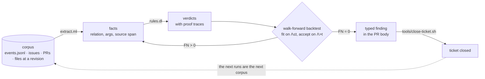

<div align="center">

# Ouroboros

**Mine what your agents did for the next rule they need, and prove the rule before it ships.**

[What it is](#what-it-is) · [What you can do](#what-you-can-do-with-it) · [The loop](#the-loop) · [Quick start](#quick-start) · [Worked example](#worked-example-draft-pr-late) · [Write a miner](#writing-a-miner) · [Status](#status) · [Reference](#reference)

</div>

<!-- agent-drafted (#379): awaiting operator approval -->

## What it is

[CSF](../../README.md) runs AI coding [agents](../../csf/docs/generated/ontology_cgen.md#term-agent) under rules: every agent works in a
harness session, and every shell command and commit it makes passes a
[gate](../../csf/docs/generated/ontology_cgen.md#term-session_gate). Gates are only as good as the mistakes someone thought of in
advance. Ouroboros finds the ones nobody did.

> [Ouroboros](../../csf/docs/generated/ontology_cgen.md#term-ouroboros) uses evaluated results to propose the next version of an [agent](../../csf/docs/generated/ontology_cgen.md#term-agent)'s instructions or an allowed workflow; RRSI is its method.

That sentence is the ontology's definition, unchanged. This directory is its
mining half. A **miner** reads a corpus (harness event logs, tickets, pull
requests, files at a revision), turns it into facts, and derives verdicts with a
Datalog rule. A miner is accepted only when a walk-forward backtest finds every
labeled offense it should, and an accepted miner becomes the next gate. The
gated runs then become the corpus for the next miner: the snake eats its tail.

You write two files, `extract.ml` and `rules.dl`, on a contract that is already built.

## What you can do with it

- **Turn a complaint into a gate.** A mistake the operator flags becomes labeled instances; a miner that finds every one of them, and nothing clean, closes the ticket.
- **Prove a rule before you enforce it.** Thresholds are fitted on the earlier half of the record and judged on the later half, so a miner cannot pass by memorizing its examples.
- **See the evidence behind every finding.** Each verdict carries its proof: the facts it used and the source line of each.
- **Measure how early a rule would have fired.** The backtest reports lead time: how long before the operator noticed, the miner would have.
- **Close tickets only on proof.** `tools/close-ticket.sh` closes a ticket only when the merged pull request's backtest shows no missed offense.

## The loop

Figure 1 shows one turn of the loop.

<a id="figure-1"></a>



**Figure 1.** The Ouroboros loop. A miner extracts facts from the corpus, a Datalog rule derives verdicts with proofs, and a walk-forward backtest decides: a miner with no missed offense becomes a typed finding that can close its ticket, and the next runs become the next corpus.

Each arrow is one typed artifact, and each has a check: `extract.ml` and `rules.dl` must pass `miner_test`, the backtest block is generated (never typed), and `tools/close-ticket.sh` closes a ticket only when the merged pull request's `Backtest FN` row is 0 and every check row exits 0.
## Quick start

Copy the template and give it your miner's name (in `extract.ml`, set `name`, `package` and `verdicts`):

```bash
cp -r services/ouroboros/miners/_template services/ouroboros/miners/my_miner
```

Test, build and run the template as it ships. This is real output from this branch, with Bazel's progress lines, the findings' `proof` arrays and the backtest's first rows trimmed (`…`):

```console
$ tools/bazel.sh test //services/ouroboros/miners/_template:miner_test --test_output=all
…
draft-pr-late: 4 tests passed
…
//services/ouroboros/miners/_template:miner_test                (cached) PASSED in 0.0s

$ tools/bazel.sh build //services/ouroboros/miners/_template:miner
INFO: Build completed successfully, 4 total actions

$ bazel-bin/services/ouroboros/miners/_template/miner.exe findings --knee 468 'services/ouroboros/miners/_template/fixtures/*/events.jsonl'
{"miner":"draft-pr-late","rule":"invisible","subject":[{"text":"6c1f2a10-3b7e-4d6a-9e51-0a1b2c3d4e31"}],"severity":"SEVERITY_S3","proof":[…]}
{"miner":"draft-pr-late","rule":"invisible","subject":[{"text":"6c1f2a10-3b7e-4d6a-9e51-0a1b2c3d4e60"}],"severity":"SEVERITY_S3","proof":[…]}

$ bazel-bin/services/ouroboros/miners/_template/miner.exe backtest services/ouroboros/miners/_template/fixtures/labels.tsv 'services/ouroboros/miners/_template/fixtures/*/events.jsonl'
…
| Backtest $\kappa^\star$ | 468 (argmax precision on $\Lambda_{\le t}$ s.t. FN = 0; 3 candidates from `score`) |
| Backtest TP | 1: 6c1f2a10-3b7e-4d6a-9e51-0a1b2c3d4e60 |
| Backtest FP | 0 |
| Backtest FN | 0 |
```

The miner's verbs are `facts`, `findings [--knee K]` and `backtest [--json] LABELS ITEM...`. Swap the fixture glob for `'<state>/*/events.jsonl'`, where `<state>` is the harness state directory, to run over every recorded run.
## Worked example: DRAFT-PR-LATE

The template flags a harness run whose work stayed invisible to the operator, with no draft pull request, for longer than a knee measured from the runs themselves ([#102](https://github.com/candacelabs/csf_staging/issues/102)). Its fixtures are three real runs.

**Facts** (`miner.exe facts` on the fixtures; `score` is seconds from start to the first draft pull request, or to the last event when there is none):

| Run | `gated` | `opened` | `score` (s) | Source lines |
|---|---|---|---|---|
| `4e31` | yes | yes | 3089 | 2, 3 |
| `4e59` | yes | yes | 468 | 2, 3 |
| `4e60` | yes | no | 1259 | 2, 3 |

**Rule** (`rules.dl`):

```prolog
invisible(R) :- gated(R), score(R, S), knee(K), gt(S, K).
```

**Labels** (`fixtures/labels.tsv`), ordered by start and split at $t$ = 2026-10-02T18:04:45Z:

| Run | Label | Half |
|---|---|---|
| `4e31` | + | fit |
| `4e59` | − | fit |
| `4e60` | + | accept |

**Knee.** The candidates are the measured scores, $K = \{468, 1259, 3089\}$, and the fit half chooses among them:

$$\kappa^\star = \arg\max_{\kappa \in K} \mathrm{precision}(\kappa; \Lambda_{\le t}) \ \text{s.t.}\ \mathrm{FN}(\kappa; \Lambda_{\le t}) = 0$$

| $\kappa$ | Fires in fit half | Precision | FN |
|---|---|---|---|
| 468 | `4e31` | 1 | 0 |
| 1259 | `4e31` | 1 | 0 |
| 3089 | none | 0 | 1 |

Ties keep the smallest knee, which fires earliest, so $\kappa^\star = 468$.

**Backtest** (`miners/_template/backtest.md`, generated, and checked current by `miner_test`):

| Measured | Result |
|---|---|
| TP | 1 (`4e60`) |
| FP | 0 |
| FN | 0 |
| Lead | 304 s |

Lead is $t_{\mathrm{flag}} - (t_{\mathrm{start}} + \kappa^\star) = 772 - 468 = 304$ s: the miner would have fired five minutes before the operator flagged `4e60`. The finding carries its proof, `gated(4e60)`, `score(4e60, 1259)` and `knee(468)`, each with its source line.
## Writing a miner

1. Read the ticket and every comment: its named instances are your labels and its predicate is your rule.
2. Copy `miners/_template` to `miners/<name>`; in `extract.ml` set `name`, `package` and `verdicts`.
3. Write `extract`: one corpus item in, facts out, each with its source span. Emit a `score` fact if the rule needs a knee.
4. Write `rules.dl` with its `/* predicate */` block; thresholds read `knee(K)`.
5. Put each labeled instance in `fixtures/<instance>/events.jsonl` (only the lines a fact needs) and list it in `fixtures/labels.tsv`: instance, `+` or `-`, start, flagged time or `-`, source.
6. Run `tools/bazel.sh test //services/ouroboros/miners/<name>:miner_test` until it passes; paste the block it prints into `backtest.md`.
7. Write the README from the template's, with the agent-drafted marker and the backtest block.
8. Run `python3 tools/check_operator_identifiers.py`, commit with the `CSF-Session` and `CSF-Model` trailers, push, and open a draft pull request.
9. Run `bash tools/check-merge.sh`; on exit 0 mark the pull request ready. Never merge.
## Pitfalls

Each row is a mistake seen in tonight's proposals or in the template's own history.

| Pitfall | Counterexample (wrong) | Example (right) |
|---|---|---|
| nested term | `gt(L, knee(K))` | `knee(K), gt(L, K)` |
| written threshold | `gt(L, 2000)` | `knee(K), gt(L, K)` |
| unbound negation | `bad(X) :- ~seen(X).` | `bad(X) :- run(X), ~seen(X).` |
| relation no extractor emits | `latency(Q, L)` | `extract.ml` emits `latency` |
| label that is not an instance | `#222` | `6c1f2a10-…-4e60` |
| knee fit on the judged labels | fit and accept on $\Lambda$ | fit $\Lambda_{\le t}$, accept $\Lambda_{>t}$ |
| no positive after the split | `+` labels only before $t$ | a `+` in the later half |
| hand-set knee | $\kappa = 900$: lead −128 s | $\kappa^\star = 468$: lead 304 s |
| `>=` for "longer than" | `ge(S, K)`: $\kappa^\star = 1259$, lead −487 s | `gt(S, K)` |

The engine checks neither safety nor stratification, so `Contract.check_rules` does: an unbound negation raises `Invalid_rules "negation before its variables are bound"`, and every miner's test runs it first.
## Status

The contract, the template miner and its gates are built; the CSF service around them, the PBO guard and dreaming are planned.

| Measured | Before this service | Now | Command |
|---|---|---|---|
| miners that build and run | 0 | 1 | `ls services/ouroboros/miners` |
| miners with walk-forward FN = 0 | 0 | 1 | `tools/bazel.sh test //services/ouroboros/...` |
| contract and template tests | 0 | 2 pass | same |
| miner proposals from tickets | 0 | 110 | [first mining run](#first-mining-run) |
| proposals that can reach TP > 0 on the template extractor | — | 0 | [census](https://github.com/candacelabs/csf_staging/pull/41#issuecomment-5964142217) |

### First mining run

On 2026-10-03 the orchestrator ran a first pass over the mining tickets. These are **proposals, not miners**: the orchestrator's miner loop asked one stateless safe-mode Haiku call per ticket batch to write a predicate, facts, rules and labels for each open mining ticket, and posted each as a ticket comment. No backtest has run on any of them.

| Measured | Value |
|---|---|
| tickets mined | 110 |
| model calls | 17 |
| largest batch | 11 tickets |
| artifacts written | 110 |
| ticket comments posted | 110 |
| refused by the identifier gate | 0 |
| cost | $1.4033 |
| cost per ticket | $0.0128 |
| call seconds per ticket | 18.4 |
| input tokens (uncached + cache creation) | 170 + 170,878 = 171,048 |
| cache read tokens | 0 |
| output tokens | 212,278 |
| load1 at call | 33.73–278.46 |
| backtested | 0 |

Source: the loop's `state/costs.tsv` (one row per call: family, tickets, artifacts, input, cache read, cache creation, output tokens, USD, wall seconds, load1), `state/posted.tsv` (one row per comment) and no `state/refused.tsv`. Reproduce the sums from the loop's directory:

```bash
python3 -c "R=[l.split('\t') for l in open('state/costs.tsv') if l.strip()]; s=lambda i: sum(float(r[i]) for r in R); print(len(R), s(1), max(int(r[1]) for r in R), s(3), s(4), s(5), s(6), round(s(7), 4), round(s(8) / s(1), 1))"
```

Call seconds per ticket sum each call's wall time; calls ran four at a time, so elapsed time was shorter. Every call wrote its whole prompt into the cache and none read it back. The [census on #41](https://github.com/candacelabs/csf_staging/pull/41#issuecomment-5964142217) measures these proposals against the contract: 0 of 110 can reach TP > 0 with the template's extractor, because each needs its own.

## Reference

### The contract

Every record is typed in `contract/contract.mli`, with its wire form in `contract/records.proto`; `Corpus` reads event logs and transcripts in place, `gh` tickets and pull requests, and files at a revision.

| Record | Fields |
|---|---|
| Fact | `relation`, `args`, `span` |
| Finding | `miner`, `rule`, `subject`, `severity`, `proof` |
| Backtest | `labels`, `split`, `knee`, `families`, `tp`, `fp`, `fn`, `lead` |

An argument is `Text` or `Number`, and a span is a file and a line. Severity runs S0 to S3 ([#105](https://github.com/candacelabs/csf_staging/issues/105)): S0 is a gate escape, S3 an offense found only by mining. `families` counts the $\kappa$ candidates tried, so multiple testing is visible on every backtest.

### The gates this service owns

| Gate | Passes when |
|---|---|
| `miner_test` | rules safe, labels fire as labeled, FN = 0, TP > 0, `backtest.md` current |
| `tools/close-ticket.sh <ticket> <pr>` | `Backtest FN` row is 0 and every check row exits 0 |

`tools/close-ticket.sh --dry-run 211 23` exits 1 with `the pull request body has no | Backtest FN | row`; without `--dry-run` it comments that row and leaves the ticket open. Walk-forward acceptance follows [Bergmeir and Benítez 2012](https://doi.org/10.1016/j.ins.2011.12.028); the acceptance first written for #390 chose the knee on the record it then judged, and [#86](https://github.com/candacelabs/csf_staging/issues/86) replaced it.

### The $h_{\mathrm{fleet}}$ floor

$h_{\mathrm{fleet}}$ is the fleet's prompt-cache hit ratio ([#235](https://github.com/candacelabs/csf_staging/issues/235)) over every harness `result` event's usage:

$$h_{\mathrm{fleet}} = \frac{\sum \mathrm{cache\_read}}{\sum (\mathrm{input} + \mathrm{cache\_creation} + \mathrm{cache\_read})}$$

The 0.9867 floor is a stated number, so it carries its reality check ([#241](https://github.com/candacelabs/csf_staging/issues/241)):

| Stated | Measured | Runs | Runs below | Used by |
|---|---|---|---|---|
| 0.9867 | 0.9870 | 73 | 40 | none |

Measured on 2026-10-03 with:

```bash
jq -n '[inputs | select(.event_type == "result") | .event.usage // {}
  | {r: (.cache_read_input_tokens // 0),
     t: ((.input_tokens // 0) + (.cache_creation_input_tokens // 0) + (.cache_read_input_tokens // 0))}]
  | (map(.r) | add) / (map(.t) | add)' <state>/*/events.jsonl
```

The fleet clears the floor (0.9870 ≥ 0.9867), yet 40 of the 73 runs fall below it on their own ratio $h_r$, so a fleet-wide pass hides a majority of offending runs; #235 ranks those offenders for a miner to drive down. Tonight's 17 proposal calls read 0 cached tokens, so their ratio is 0.

### PBO guard (planned)

Walk-forward answers in-sample selection ([Bailey, Borwein, López de Prado and Zhu 2014](https://doi.org/10.1090/noti1105)) but not multiple testing. The probability of backtest overfitting ([Bailey et al. 2016](https://doi.org/10.21314/JCF.2016.322)) splits the record into $S$ blocks; each of the $\binom{S}{S/2}$ halvings $c$ picks the best candidate in sample, with relative rank $\omega_c$ out of sample:

$$\mathrm{PBO} = \Pr_c\left[\lambda_c \le 0\right], \qquad \lambda_c = \ln\frac{\omega_c}{1 - \omega_c}$$

| Record | Labels | After $t$ | `families` | PBO |
|---|---|---|---|---|
| template fixtures | 3 | 1 | 3 | undefined |
| every recorded run | 3 | 1 | 60 | undefined |

With $S = 2$ each half holds one or two labels, too few to rank candidates; the guard waits for a label set with a positive in each of $S \ge 4$ blocks.

### Dreaming (planned)

Dreaming is the loop pointed at the language and the queue rather than at one gate ([#140](https://github.com/candacelabs/csf_staging/issues/140)): a dreamer classifies operator intents and proposes terms, gates and ranked work, and an actor executes turns and never edits the language. Its objective is minimum description length ([Rissanen 1978](https://doi.org/10.1016/0005-1098(78)90005-5)), choosing the language $L$ that minimizes $|L| + \sum_{i} |\mathrm{encode}(i \mid L)|$. It runs at two speeds, after complementary learning systems ([McClelland, McNaughton and O'Reilly 1995](https://doi.org/10.1037/0033-295X.102.3.419)): the nightly dream ratifies, and online dreaming ([#141](https://github.com/candacelabs/csf_staging/issues/141)) mints provisional [session gates](../../csf/docs/generated/ontology_cgen.md#term-session_gate) that expire unless ratified.

- **Example (build it, #141):** swap the gates at a tool-call boundary; the hook binary reads its rules on every call, so a rule published between two calls binds from the next one.
- **Counterexample (dropped, #141):** swap code into the Go process during a GC pause; Go has no JIT, and a `plugin` can never be unloaded.

Neither speed has code here yet; a miner's findings are the dream's input once it lands.
